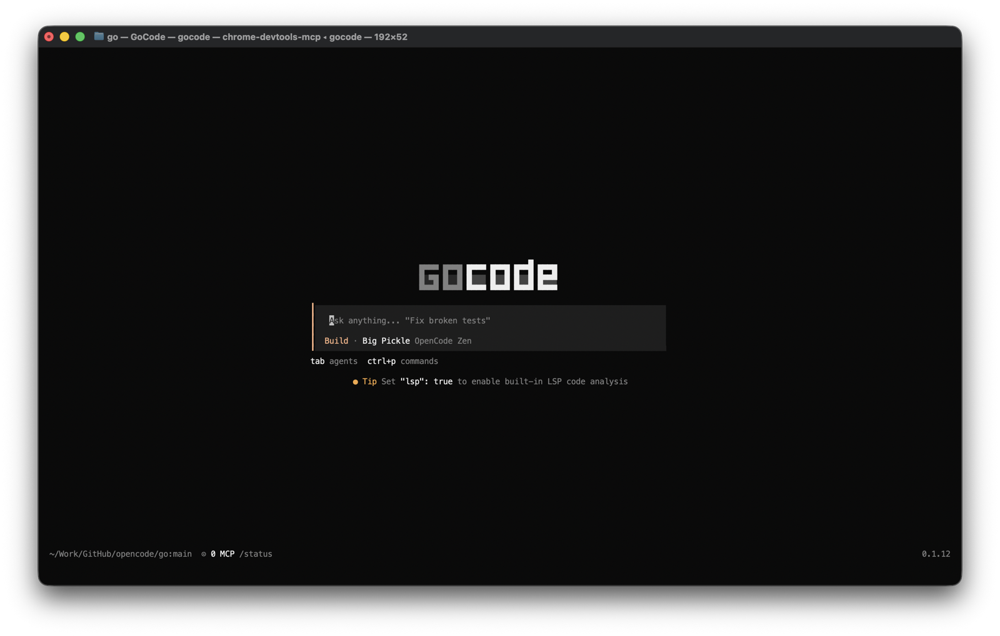
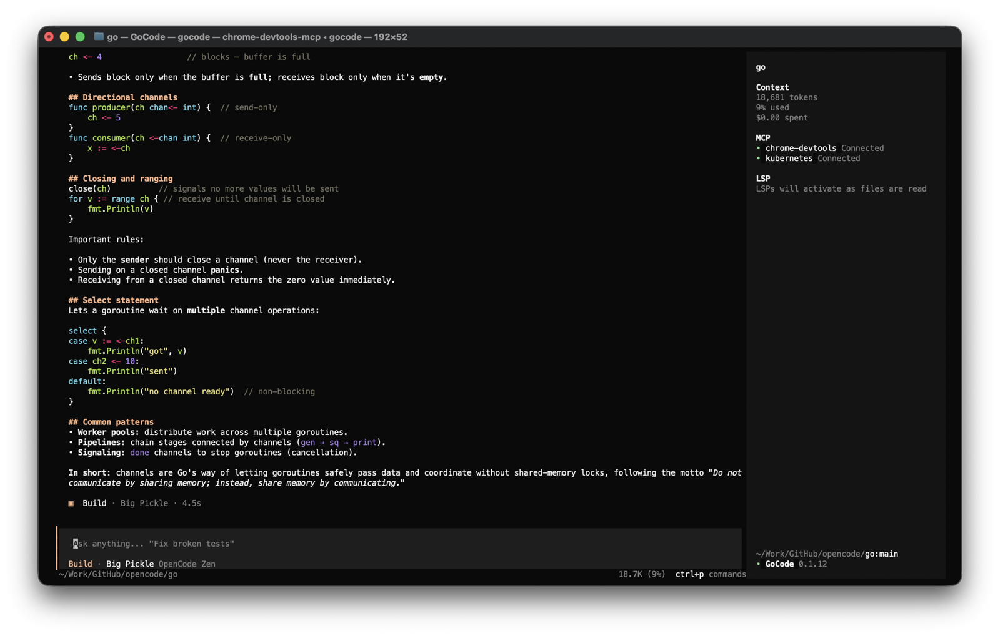
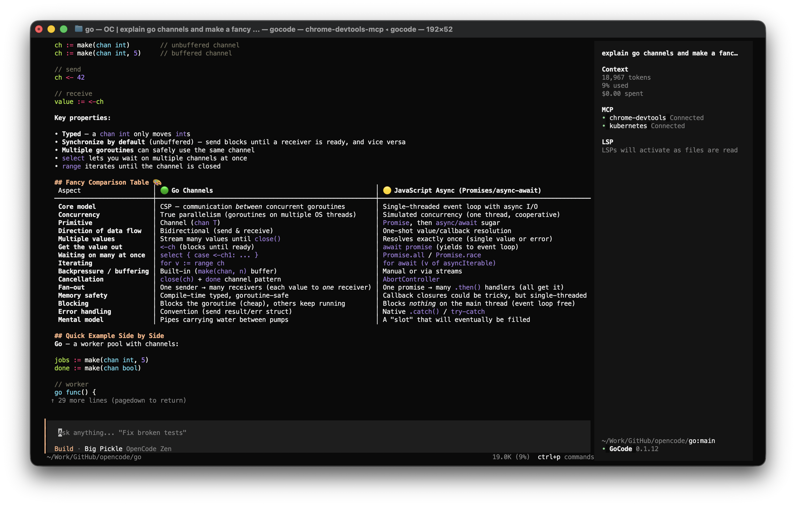
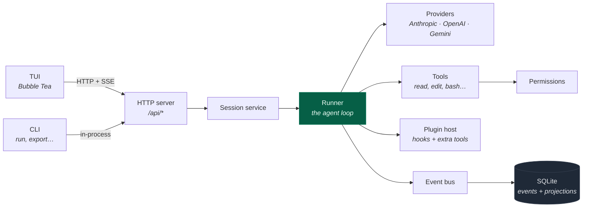

<div align="center">

# gocode

**A complete Go port of the [opencode](https://github.com/anomalyco/opencode) coding agent.**

One statically linked binary. No Node, no Bun, no runtime to install.

[](https://github.com/langazov/gocode/actions/workflows/ci.yml)
[](https://github.com/langazov/gocode/actions/workflows/release.yml)
[](https://go.dev)
[](LICENSE)

[Install](#install) · [Quick start](#quick-start) · [Documentation](documentation/) · [Website](https://langazov.github.io/gocode/)

</div>

---

<div align="center">



<sub>Launch it in any directory — agent and model live on the prompt, <code>tab</code> switches agents, <code>ctrl+p</code> opens commands.</sub>

<br><br>



<sub>A turn in flight, with context, spend, MCP servers and language servers in the sidebar.</sub>

<br><br>



<sub>Markdown rendered in full — headings, tables, bold/italic/inline code, and syntax-highlighted code blocks.</sub>

</div>

## Why

The original opencode is a TypeScript application. This is a full rewrite in Go
with the same behaviour, the same on-disk format, and the same HTTP API —
delivered as a single ~25 MB executable you can drop on a box with nothing else
installed.

| | |
|---|---|
| **Zero runtime deps** | `CGO_ENABLED=0` everywhere. SQLite is [modernc](https://gitlab.com/cznic/sqlite), a pure-Go translation — so cross-compiling all six targets happens on one Linux runner. |
| **Durable by construction** | Every turn is event-sourced into SQLite. Kill the process mid-stream and the session resumes exactly where it stopped. |
| **Agent-native** | 13 built-in tools, sub-agent spawning, MCP servers, skills, plugins, and 27 language servers wired into the same permission engine. |
| **Extensible** | Plugins hook the request, the prompt, tool calls and permissions, and can add tools of their own. A plugin is an executable in any language — the binary stays one static file. |
| **Actually tested** | 960 tests across 34 packages, ~25k lines of test code against ~41k lines of source. |

## Install

### Homebrew (macOS and Linux)

The shortest path on either platform. The formula lives in
[langazov/homebrew-tap](https://github.com/langazov/homebrew-tap) and covers
macOS on Apple silicon and Intel, and Linux on x86_64 and arm64.

```sh
brew install langazov/tap/gocode
```

That one command taps the repository and installs in a single step. To tap
once and refer to the formula by its short name afterwards:

```sh
brew tap langazov/tap
brew install gocode
```

Either way `gocode` lands on your `PATH` — under `/opt/homebrew/bin` on Apple
silicon, `/usr/local/bin` on Intel macOS, and
`/home/linuxbrew/.linuxbrew/bin` on Linux. Check it with:

```sh
gocode --version
```

Homebrew does not quarantine what a *formula* downloads, so the
`xattr -d com.apple.quarantine` step needed for a hand-downloaded binary does
not apply here.

Later versions arrive through the usual commands — the tap is refreshed by
`brew update`, which `brew upgrade` runs for you:

```sh
brew upgrade gocode
```

To remove it:

```sh
brew uninstall gocode
brew untap langazov/tap   # optional, drops the tap as well
```

Homebrew itself is a prerequisite. If you do not have it, see
[brew.sh](https://brew.sh) — the same installer covers macOS and Linux.

### Download a binary

Grab one from the [latest release](https://github.com/langazov/gocode/releases/latest).
Every platform ships twice — a bare executable and an archive of the same build.

**macOS / Linux**

```sh
# replace <platform> with e.g. macos-arm64, linux-x64
curl -fsSL -o gocode \
  https://github.com/langazov/gocode/releases/latest/download/gocode-<version>-<platform>
chmod +x gocode
sudo mv gocode /usr/local/bin/
```

macOS binaries are unsigned, so Gatekeeper quarantines them on first run:

```sh
xattr -d com.apple.quarantine /usr/local/bin/gocode
```

**Windows** — download `gocode-<version>-windows-x64.exe`, rename it to
`gocode.exe`, and put it on your `PATH`.

Verify any download against the release's `SHA256SUMS`:

```sh
sha256sum -c SHA256SUMS --ignore-missing
```

### Build from source

Requires Go 1.27+.

```sh
git clone https://github.com/langazov/gocode
cd gocode
make build      # -> ./gocode
```

| Target | Does |
|---|---|
| `make build` | build `./gocode` with a git-derived version |
| `make test` | run the full suite |
| `make fmt` | format the tree |
| `make check` | fmt-check + vet + test — what CI runs |
| `make release` | optimised build into `dist/` |

`make help` lists them all.

## Quick start

```sh
gocode                       # interactive TUI in the current directory
gocode /path/to/project      # ...or somewhere else
```

First run will ask you to connect a provider:

```sh
gocode providers login       # OAuth or API key, stored in the local keyring
gocode models                # list everything you can now reach
```

Then use it:

```sh
gocode run "add a health check endpoint"   # one-shot, no TUI
gocode -c                                  # continue the last session
gocode serve --port 4096                   # headless server
gocode attach http://box:4096              # drive a remote server from your terminal
```

<details>
<summary><b>Full command list</b></summary>

```
acp          start ACP (Agent Client Protocol) server
agent        manage agents
attach       attach to a running gocode server
completion   generate shell completion script
db           database tools
debug        debugging and troubleshooting tools
export       export session data as JSON
github       manage GitHub agent
import       import session data from JSON file or URL
mcp          manage MCP (Model Context Protocol) servers
models       list all available models
plugin       install plugin and update config
pr           fetch and checkout a GitHub PR branch, then run gocode
providers    manage AI providers and credentials
run          run gocode with a message
serve        starts a headless gocode server
session      manage sessions
stats        show token usage and cost statistics
tui          start the interactive terminal interface
upgrade      upgrade gocode to the latest or a specific version
web          start gocode server and open web interface
```

</details>

## How it fits together

The TUI is **always** an HTTP client — even locally. `gocode` boots the
service stack, starts a server on an ephemeral loopback port, and connects to
it. `gocode attach` is the identical path pointed at a different host, which
is why remote and local behave the same.



Everything the agent does becomes a durable event before it becomes visible
state. A turn is a sequence of `step.started → text.delta* → tool.called →
tool.success → step.ended` events committed atomically with their projections,
so the UI, the API, and a resumed process all read the same history.

**[→ Read the full documentation](documentation/)** — architecture, the data
model, the runner loop, providers, tools, the TUI, and the HTTP API.

## Configuration

Config is JSON, merged from global and project scope:

```
~/.config/gocode/gocode.json     global
./gocode.json                      project (overrides global)
```

```jsonc
{
  "model": "anthropic/claude-sonnet-5",
  "theme": "gocode-dark",
  "permission": {
    "bash": "ask",
    "external_directory": "ask"
  },
  "lsp": { "gopls": { "disabled": false } },
  "mcp": {
    "github": { "type": "local", "command": ["gh-mcp"] }
  },
  "plugin": ["my-plugin", ["./tools/lint", { "strict": true }]]
}
```

See [documentation/07-configuration.md](documentation/07-configuration.md) for
every key.

## Plugins

MCP adds tools. **Plugins change behavior** — what the model is told, what a
tool call runs with, what its result looks like, whether a permission is even
asked.

A plugin is an **executable**, not a library: gocode spawns it and speaks
JSON-RPC over stdio. That is this port's answer to a problem the TypeScript
original does not have — a linked Go binary cannot `import()` unknown code, so
external plugins run beside it instead. They can be written in any language,
and the binary stays a single static file with no runtime.

```sh
make install-example-plugin      # build, install, and enable examples/plugin-echo
gocode debug info                # confirm it loaded
```

Installing copies the plugin to `~/.config/gocode/plugin/` **and** enables it in
your global config, so plain `gocode` picks it up in any directory. Those are
two separate steps: a plugin runs only when the config's `plugin` array names
it, so a copied-but-unlisted plugin is inert.

```sh
make install-plugin PLUGIN=./my-plugin   # copy + enable
make disable-plugin NAME=my-plugin       # leave installed, stop loading it
make uninstall-plugin NAME=my-plugin     # remove both
```

Hooks cover the request (`chat.params`, `chat.headers`), the system prompt,
tool definitions and execution, permissions, and compaction. A plugin can also
contribute tools, which appear to the model exactly like the built-ins.

**[→ Plugins, in full](documentation/09-integrations.md#plugins)** ·
[worked example](examples/plugin-echo)

## Project layout

```
cmd/gocode/       CLI entry point and subcommands
internal/
  session/          the agent loop: runner, coordinator, compaction
  llm/              provider clients (anthropic, openai, gemini)
  provider/         catalog, auth, transforms
  tool/             tool registry + 13 builtins
  permission/       the allow/deny/ask engine
  plugin/           plugin host: hooks, subprocess tier, loader
  event/            event store, projections, replay
  db/               SQLite schema and migrations
  server/           HTTP API
  tui/              Bubble Tea interface
  lsp/  mcp/        language server and MCP clients
examples/           worked examples (plugin-echo)
documentation/      detailed docs (start here)
docs/               the published website
```

## Contributing

```sh
make check    # fmt + vet + test — CI runs the same thing
```

CI builds on Linux, macOS and Windows. Releases are cut by pushing a tag:

```sh
git tag v0.1.0 && git push origin v0.1.0
```

That cross-compiles all six targets, smoke-tests each one on its native
runner, and publishes the release with checksums.

## License

MIT — see [LICENSE](LICENSE).

Ported from [opencode](https://github.com/anomalyco/opencode).
