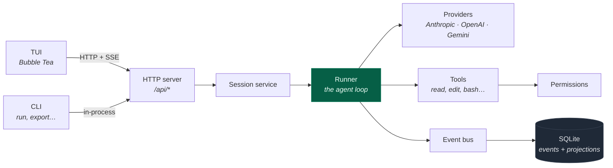

<div align="center">

# gocode

**A complete Go port of the [opencode](https://github.com/anomalyco/opencode) coding agent.**

One statically linked binary. No Node, no Bun, no runtime to install.

[](https://github.com/langazov/gocode/actions/workflows/ci.yml)
[](https://github.com/langazov/gocode/actions/workflows/release.yml)
[](https://go.dev)
[](LICENSE)

[Install](#install) · [Quick start](#quick-start) · [Documentation](documentation/) · [Website](https://langazov.github.io/gocode/)

</div>

---

```
┌─ gocode ────────────────────────────────────── gpt-5 · build ─┐
│                                                                  │
│  › refactor the auth middleware to use the new token store       │
│                                                                  │
│  ● read      internal/auth/middleware.go                          │
│  ● grep      "tokenStore" · 7 matches in 3 files                  │
│  ● edit      internal/auth/middleware.go  +24 −11                 │
│  ● bash      go test ./internal/auth/...                          │
│    ok  github.com/you/app/internal/auth   0.42s                   │
│                                                                  │
│  Swapped the middleware onto TokenStore.Lookup and dropped the   │
│  now-unused session cache. Tests pass.                            │
│                                                                  │
└──────────────────────────────────────────────────────────────────┘
  ~/app  ⎇ main   ● gopls   12.4k tokens   $0.03
```

## Why

The original opencode is a TypeScript application. This is a full rewrite in Go
with the same behaviour, the same on-disk format, and the same HTTP API —
delivered as a single ~25 MB executable you can drop on a box with nothing else
installed.

| | |
|---|---|
| **Zero runtime deps** | `CGO_ENABLED=0` everywhere. SQLite is [modernc](https://gitlab.com/cznic/sqlite), a pure-Go translation — so cross-compiling all six targets happens on one Linux runner. |
| **Durable by construction** | Every turn is event-sourced into SQLite. Kill the process mid-stream and the session resumes exactly where it stopped. |
| **Agent-native** | 13 built-in tools, sub-agent spawning, MCP servers, skills, and 27 language servers wired into the same permission engine. |
| **Actually tested** | 862 tests across 33 packages, ~22k lines of test code against ~36k lines of source. |

## Install

### Homebrew (macOS / Linux)

```sh
brew install langazov/tap/gocode
```

Upgrades come through `brew upgrade gocode` once the tap is added. Homebrew
does not quarantine formula downloads, so no `xattr` step is needed.

### Download a binary

Grab one from the [latest release](https://github.com/langazov/gocode/releases/latest).
Every platform ships twice — a bare executable and an archive of the same build.

**macOS / Linux**

```sh
# replace <platform> with e.g. macos-arm64, linux-x64
curl -fsSL -o gocode \
  https://github.com/langazov/gocode/releases/latest/download/gocode-<version>-<platform>
chmod +x gocode
sudo mv gocode /usr/local/bin/
```

macOS binaries are unsigned, so Gatekeeper quarantines them on first run:

```sh
xattr -d com.apple.quarantine /usr/local/bin/gocode
```

**Windows** — download `gocode-<version>-windows-x64.exe`, rename it to
`gocode.exe`, and put it on your `PATH`.

Verify any download against the release's `SHA256SUMS`:

```sh
sha256sum -c SHA256SUMS --ignore-missing
```

### Build from source

Requires Go 1.27+.

```sh
git clone https://github.com/langazov/gocode
cd gocode
make build      # -> ./gocode
```

| Target | Does |
|---|---|
| `make build` | build `./gocode` with a git-derived version |
| `make test` | run the full suite |
| `make fmt` | format the tree |
| `make check` | fmt-check + vet + test — what CI runs |
| `make release` | optimised build into `dist/` |

`make help` lists them all.

## Quick start

```sh
gocode                       # interactive TUI in the current directory
gocode /path/to/project      # ...or somewhere else
```

First run will ask you to connect a provider:

```sh
gocode providers login       # OAuth or API key, stored in the local keyring
gocode models                # list everything you can now reach
```

Then use it:

```sh
gocode run "add a health check endpoint"   # one-shot, no TUI
gocode -c                                  # continue the last session
gocode serve --port 4096                   # headless server
gocode attach http://box:4096              # drive a remote server from your terminal
```

<details>
<summary><b>Full command list</b></summary>

```
acp          start ACP (Agent Client Protocol) server
agent        manage agents
attach       attach to a running gocode server
completion   generate shell completion script
db           database tools
debug        debugging and troubleshooting tools
export       export session data as JSON
github       manage GitHub agent
import       import session data from JSON file or URL
mcp          manage MCP (Model Context Protocol) servers
models       list all available models
plugin       install plugin and update config
pr           fetch and checkout a GitHub PR branch, then run gocode
providers    manage AI providers and credentials
run          run gocode with a message
serve        starts a headless gocode server
session      manage sessions
stats        show token usage and cost statistics
tui          start the interactive terminal interface
upgrade      upgrade gocode to the latest or a specific version
web          start gocode server and open web interface
```

</details>

## How it fits together

The TUI is **always** an HTTP client — even locally. `gocode` boots the
service stack, starts a server on an ephemeral loopback port, and connects to
it. `gocode attach` is the identical path pointed at a different host, which
is why remote and local behave the same.



Everything the agent does becomes a durable event before it becomes visible
state. A turn is a sequence of `step.started → text.delta* → tool.called →
tool.success → step.ended` events committed atomically with their projections,
so the UI, the API, and a resumed process all read the same history.

**[→ Read the full documentation](documentation/)** — architecture, the data
model, the runner loop, providers, tools, the TUI, and the HTTP API.

## Configuration

Config is JSON, merged from global and project scope:

```
~/.config/gocode/gocode.json     global
./gocode.json                      project (overrides global)
```

```jsonc
{
  "model": "anthropic/claude-sonnet-5",
  "theme": "gocode-dark",
  "permission": {
    "bash": "ask",
    "external_directory": "ask"
  },
  "lsp": { "gopls": { "disabled": false } },
  "mcp": {
    "github": { "type": "local", "command": ["gh-mcp"] }
  }
}
```

See [documentation/07-configuration.md](documentation/07-configuration.md) for
every key.

## Project layout

```
cmd/gocode/       CLI entry point and subcommands
internal/
  session/          the agent loop: runner, coordinator, compaction
  llm/              provider clients (anthropic, openai, gemini)
  provider/         catalog, auth, transforms
  tool/             tool registry + 13 builtins
  permission/       the allow/deny/ask engine
  event/            event store, projections, replay
  db/               SQLite schema and migrations
  server/           HTTP API
  tui/              Bubble Tea interface
  lsp/  mcp/        language server and MCP clients
documentation/      detailed docs (start here)
docs/               the published website
```

## Contributing

```sh
make check    # fmt + vet + test — CI runs the same thing
```

CI builds on Linux, macOS and Windows. Releases are cut by pushing a tag:

```sh
git tag v0.1.0 && git push origin v0.1.0
```

That cross-compiles all six targets, smoke-tests each one on its native
runner, and publishes the release with checksums.

## License

MIT — see [LICENSE](LICENSE).

Ported from [opencode](https://github.com/anomalyco/opencode).
