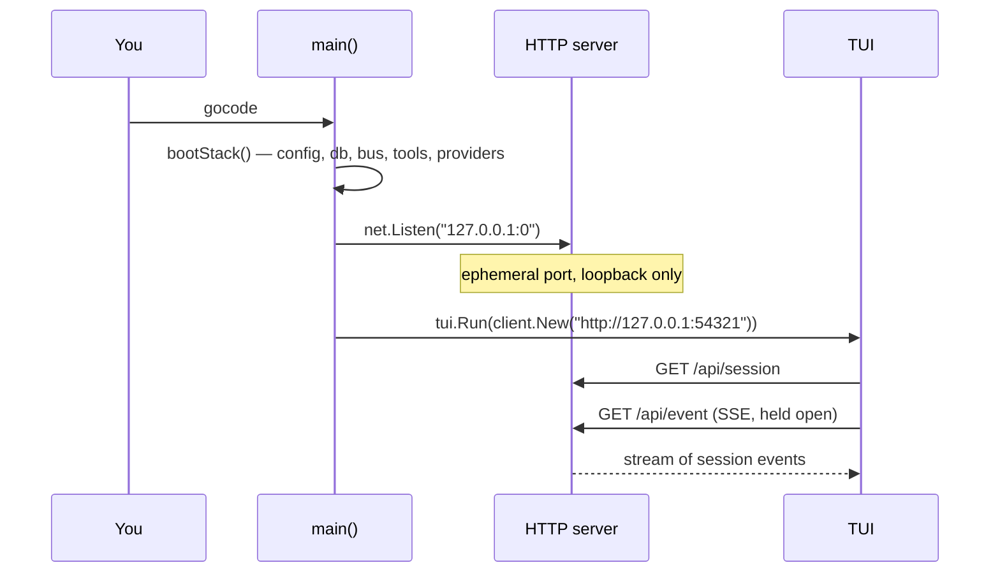
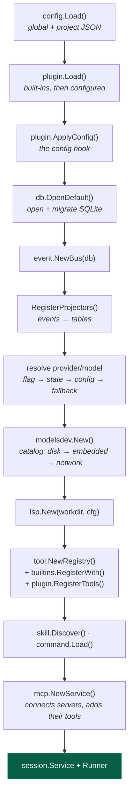
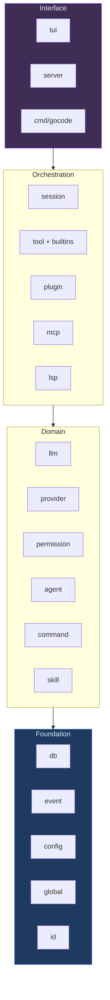
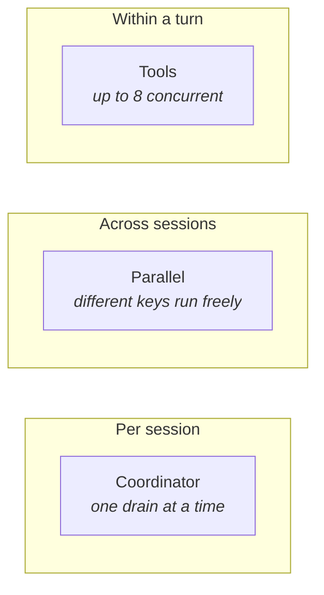

# 1. Architecture

[← Index](README.md) · [Next: Data model →](02-data-model.md)

---

## The client/server split

There is exactly one way into the system: the HTTP API. The TUI does not reach
into the session service directly, even when both live in the same process.



`cmd/gocode/cmd_tui.go` is where this happens. The consequence worth
internalising: **`gocode attach http://other-host:4096` runs the identical
TUI code path.** Local is just a server you didn't have to start yourself.

This is why the API is not an afterthought. If a feature isn't reachable over
HTTP, the TUI cannot use it.

## Boot sequence

`bootStack()` in `cmd/gocode/main.go` assembles everything in dependency
order. Roughly:



Three ordering details matter:

- **Projectors register before anything publishes.** An event with no
  registered projector commits but updates nothing, and the divergence check
  (see [Data model](02-data-model.md)) will not save you — it only catches
  projections that disagree, not projections that are missing.
- **MCP and plugins register tools into the same registry as the builtins.**
  From the runner's perspective an MCP tool, a plugin tool and `read` are
  indistinguishable; all three are `tool.Tool` values behind the same
  permission gate.
- **Plugins load before anything is built from the config**, because the
  `config` hook lets them change what gets built — including the default model
  resolved two steps later. Plugin tools register *after* the builtins, so a
  plugin can replace one by name.

### Model resolution

The model is resolved from the first source that yields one:

```
--model flag  →  per-directory saved state  →  config "model"  →  fallback probe
```

The fallback probe (`provider.Fallback`) looks for any provider with usable
credentials — an API key in the environment, a stored OAuth token — and picks
its default model. This is what makes a fresh install with `ANTHROPIC_API_KEY`
set work without configuration.

## Package layering

Dependencies point downward. Nothing in a lower layer imports from a higher
one.



| Layer | Packages | Rule |
|---|---|---|
| **Foundation** | `db` `event` `config` `global` `id` `identifier` `flock` `fsutil` | No knowledge of agents, models, or sessions. Pure infrastructure. |
| **Domain** | `llm` `provider` `permission` `agent` `command` `skill` `markdown` `diff` `patch` `credential` `auth` `modelsdev` | Model the problem. No I/O orchestration. |
| **Orchestration** | `session` `tool` `plugin` `mcp` `lsp` `background` `question` | Wire the domain together and drive it. |
| **Interface** | `tui` `server` `cmd/gocode` `clix` | Present it. Contain no business logic. |

## The three entry points

| Entry | Path | Used by |
|---|---|---|
| **TUI** | `tui.Run()` → HTTP → `server.Mux()` → service | `gocode`, `gocode tui`, `gocode attach` |
| **Headless server** | `server.ServeOn()` → service | `gocode serve`, `gocode web` |
| **Direct CLI** | service in-process, no HTTP | `gocode run`, `export`, `stats`, `db` |

`gocode run` is the exception that skips HTTP — it drives the session
service directly and streams to stdout, because there's no interactive client
to serve.

## Concurrency model

Three distinct mechanisms, easy to confuse:



- **`session.Coordinator[Key]`** serialises drains per session while letting
  different sessions run concurrently. A wake-up arriving while a drain is
  already running sets `pendingWake` rather than starting a second one — this
  is what keeps a burst of user input from racing.
- **Tool calls within a turn run concurrently**, bounded by a semaphore at
  `DefaultToolConcurrency = 8` (`internal/session/runner_tools.go`). Each call
  gets a goroutine that always emits exactly one settlement — including on
  cancellation — so the turn loop's in-flight count can never fail to drain.
- **Sub-agents** spawned via the `task` tool get their own session, and
  therefore their own coordinator entry, so they run in genuine parallel.
- **SQLite** runs in WAL mode with a single writer; `internal/flock` guards
  cross-process access.

## Where things live

```
cmd/gocode/          entry point; one file per subcommand
  main.go              bootStack() — the assembly point
  cli.go               argument parsing and dispatch

internal/
  session/             ── the heart ──
    runner.go          the agent loop
    coordinator.go     per-session serialisation
    promote.go         inbox → durable event
    compaction.go      context-window overflow recovery
    spawn.go           sub-agent sessions
    runner_plugins.go  the plugin hook seams
  event/               event store: append, project, replay, notify
  db/                  schema, migrations, connection
  llm/                 provider clients; one package per wire format
  provider/            catalog, credentials, per-provider transforms
  tool/                registry + builtins/
  permission/          allow / deny / ask
  plugin/              hook catalog, host, loader
    hook.go            Definition/Trigger — the typed dispatch core
    process.go         the subprocess tier (JSON-RPC over stdio)
  server/              HTTP handlers
  tui/                 Bubble Tea app (~11k lines, the largest package)
  lsp/  mcp/           external protocol clients
```

---

[← Index](README.md) · [Next: Data model →](02-data-model.md)
