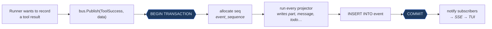
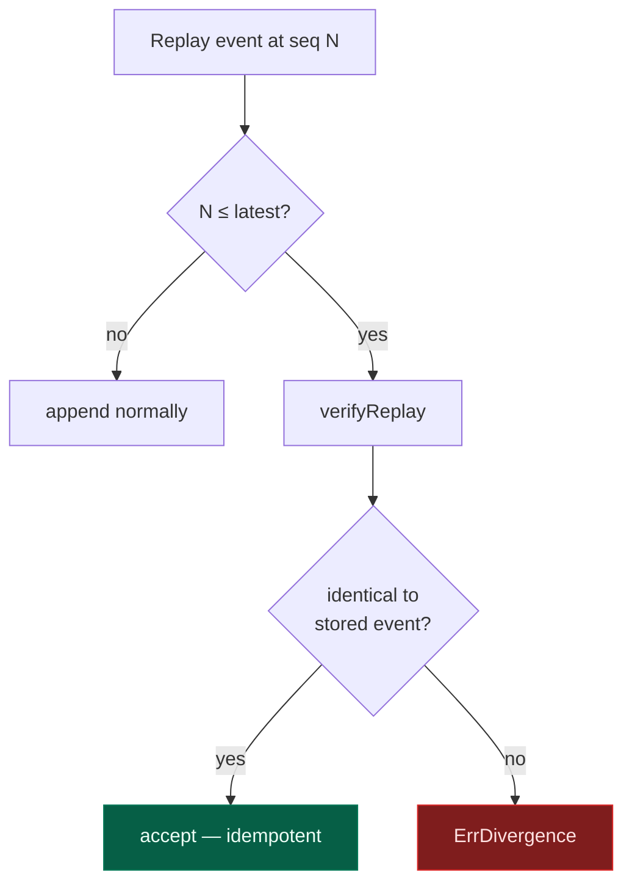
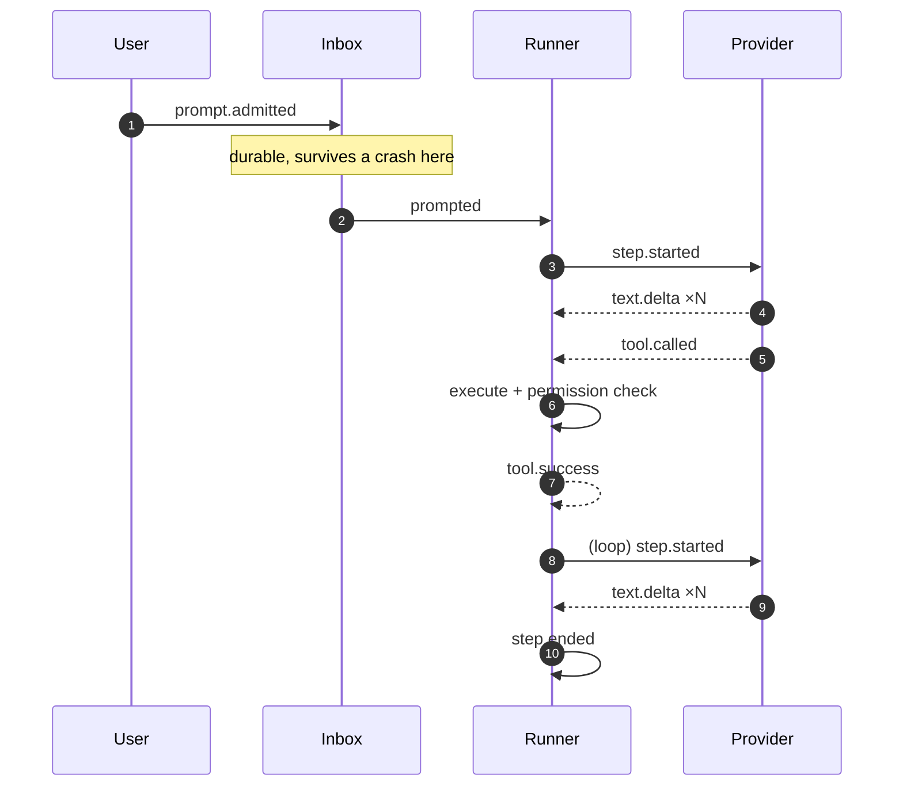
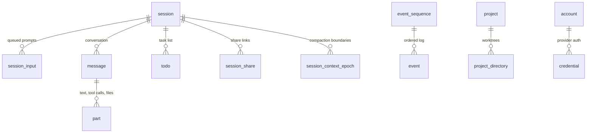

# 2. Data model

[← Architecture](01-architecture.md) · [Index](README.md) · [Next: Session runner →](03-session-runner.md)

---

Everything persists to one SQLite file. There is no server, no cache tier, and
no second source of truth.

```
$XDG_DATA_HOME/opencode/opencode.db          release builds
$XDG_DATA_HOME/opencode/opencode-dev.db      dev builds (channel-suffixed)
```

Resolved by `internal/db/path.go`; overridable with `OPENCODE_DB`. The channel
suffix means a dev build cannot corrupt your real session history.

## Event sourcing, concretely

The central idea: **the agent never writes state directly.** It publishes an
event, and the event's *projectors* write the state — both inside one
transaction.



Either the event and all its derived state land together, or neither does.
There is no window where the UI shows a tool result that isn't in the log, or
a log entry the UI never rendered.

### The two tables that make it work

```sql
CREATE TABLE event_sequence (
  aggregate_id text PRIMARY KEY,
  seq          integer NOT NULL,   -- highest sequence allocated
  owner_id     text                -- claim, for replay safety
);

CREATE TABLE event (
  id           text PRIMARY KEY,
  aggregate_id text NOT NULL,      -- the session
  seq          integer NOT NULL,   -- dense, gapless, per aggregate
  type         text NOT NULL,      -- "session.next.tool.success@1"
  data         text NOT NULL       -- JSON payload
);
```

The aggregate is the session. Sequence numbers are allocated inside the same
transaction that writes the event, so they are **dense and gapless** — a gap
means corruption, not a lost race.

Note `type` carries a version suffix (`@1`). Event schemas evolve; the version
lets a replay reject an event it doesn't understand rather than silently
misreading it.

### Replay and divergence

`Bus.Replay` re-applies an event stream — used for importing a session and for
verifying integrity. Replaying a sequence that already exists is not an error:



Re-running the same import twice is safe. Importing a *different* history over
an existing one fails loudly instead of interleaving two timelines.

`owner_id` adds a second guard: once an aggregate is claimed, a replay carrying
a different owner is refused under `strictOwner`, or skipped silently
otherwise.

## Session events

Defined across `internal/session/*.go`, all under the `session.next.*`
namespace:

| Event | Meaning |
|---|---|
| `prompt.admitted` | user input accepted into the inbox (not yet running) |
| `prompted` | input promoted into the conversation as a user message |
| `step.started` / `step.ended` / `step.failed` | one provider turn |
| `text.started` / `text.delta` / `text.ended` | assistant prose, streamed |
| `reasoning.started` / `reasoning.delta` / `reasoning.ended` | thinking blocks |
| `tool.called` | the model asked for a tool |
| `tool.success` / `tool.failed` | the local outcome |
| `compaction.started` / `compaction.ended` | context-window recovery |

A complete turn:



### Why the inbox exists

`prompt.admitted` and `prompted` look redundant. They aren't.

Admission is **acknowledgement**: your input is durably stored the moment the
API accepts it. Promotion is **scheduling**: it happens when the runner is
ready to act on it. Separating them means typing while the agent is mid-turn
queues cleanly, and a crash between the two loses nothing.

```sql
CREATE TABLE session_input (
  id            text PRIMARY KEY,
  session_id    text NOT NULL,
  prompt        text NOT NULL,
  delivery      text NOT NULL,
  admitted_seq  integer NOT NULL,
  promoted_seq  integer,            -- NULL until promoted
  time_created  integer NOT NULL
);
```

`promoted_seq IS NULL` *is* the queue.

## Schema map

19 tables, in four groups:



| Group | Tables |
|---|---|
| **Event log** | `event`, `event_sequence` |
| **Conversation** | `session`, `message`, `part`, `session_message`, `session_input`, `session_context_epoch`, `todo`, `session_share` |
| **Identity** | `account`, `account_state`, `control_account`, `credential` |
| **Workspace** | `workspace`, `project`, `project_directory`, `permission`, `data_migration` |

### Messages and parts

A message is a container; the content lives in ordered **parts**. One assistant
message typically holds several:

```
message (assistant)
├── part[0]  reasoning   "The auth middleware is in..."
├── part[1]  text        "I'll start by reading the file."
├── part[2]  tool        read   { path: "..." } → output
├── part[3]  tool        edit   { ... }         → output
└── part[4]  text        "Done — swapped it onto TokenStore."
```

This is why streaming is coherent: a `text.delta` event appends to the current
text part, and a `tool.called` event opens a new tool part. The TUI renders
parts in order and never has to reconcile interleaved streams.

## Migrations

`schema.go` holds the base schema. Data migrations are separate: they register
themselves via `RegisterMigration`, and `DB.Apply` runs the ones not already
recorded in `data_migration`. `seedLegacyJournal` back-fills that table for
databases created before the journal existed, so an old file upgrades without
re-running migrations that already happened.

Migrations are forward-only — there is no `down`. A release that must change
shape incompatibly bumps the DB filename instead, which is what the channel
suffix is for.

Pragmas are carried in the DSN (`internal/db/db.go`) so *every* connection in
the pool gets them, not just the first:

| Pragma | Value | Why |
|---|---|---|
| `journal_mode` | `WAL` | readers don't block the writer — the TUI reads while the runner writes |
| `foreign_keys` | `1` | deleting a session cascades to its messages, parts and events |
| `busy_timeout` | `5000` | absorbs contention between the runner and API handlers |

---

[← Architecture](01-architecture.md) · [Index](README.md) · [Next: Session runner →](03-session-runner.md)
