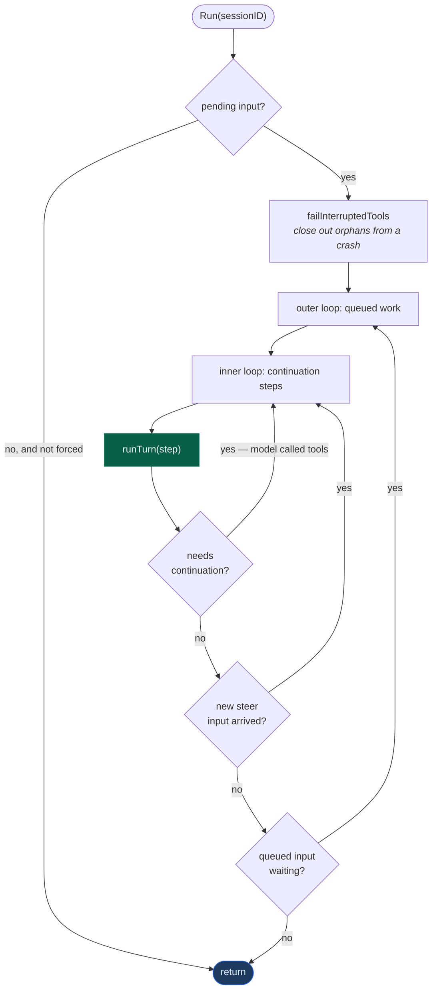
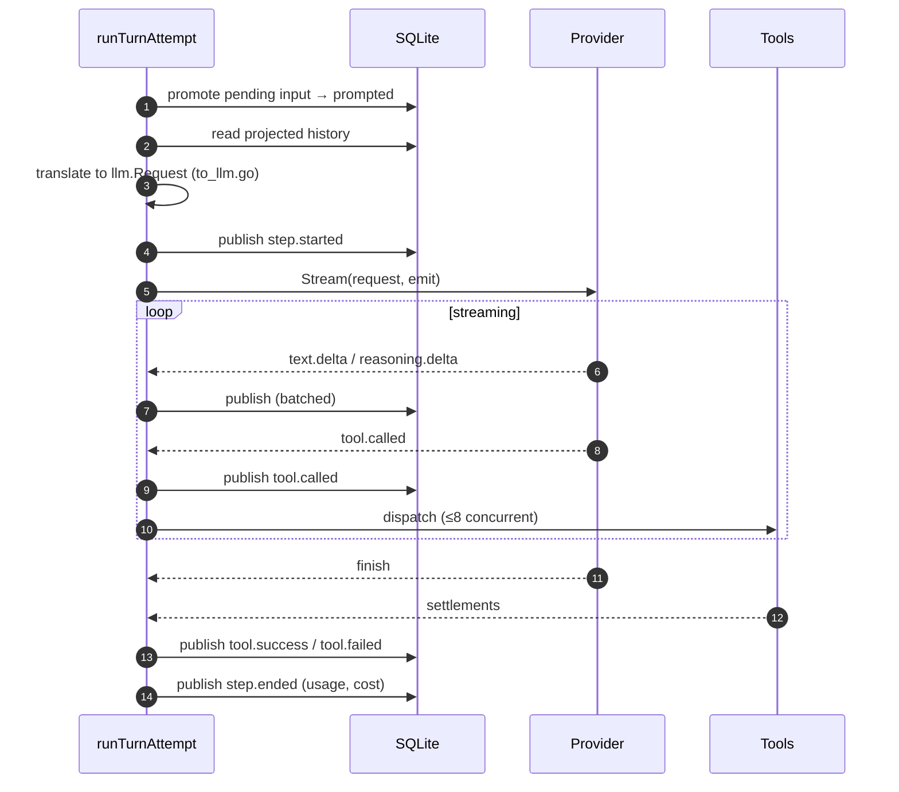
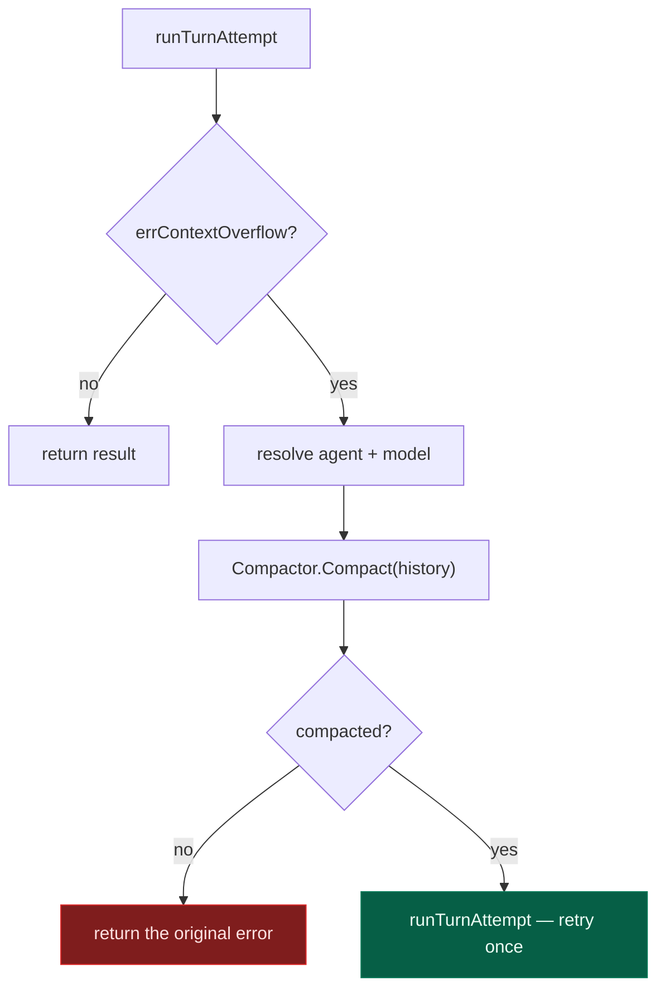
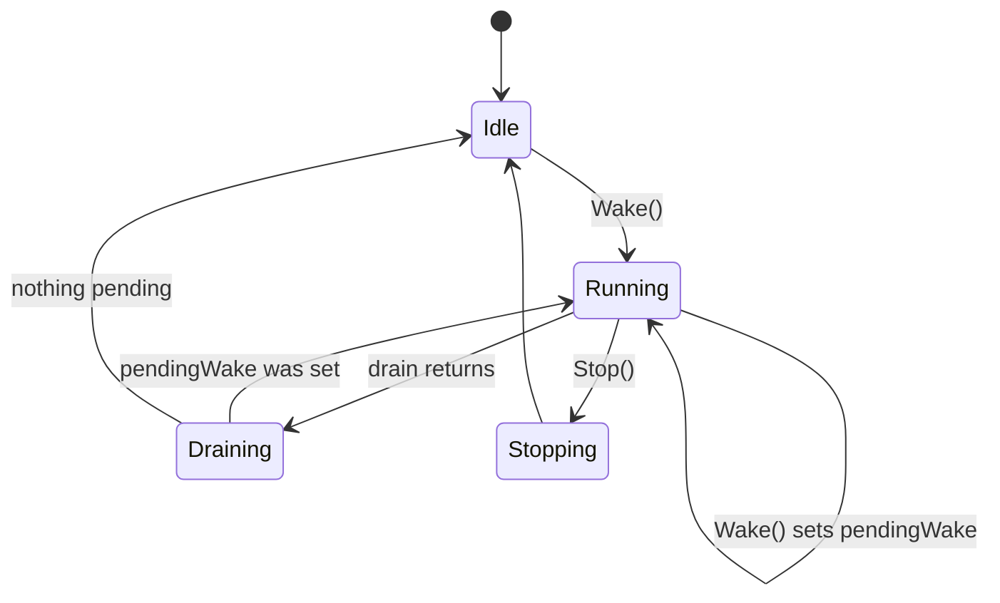
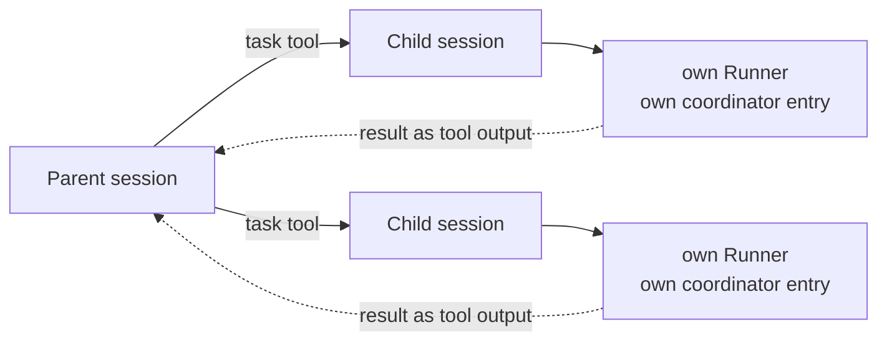

# 3. The session runner

[← Data model](02-data-model.md) · [Index](README.md) · [Next: Providers →](04-providers.md)

---

`internal/session/runner.go` is the agent. Everything else exists to serve this
loop.

Its contract, from the source:

> promote inbox rows, translate projected history, stream exactly one provider
> turn per attempt, settle local tool calls durably, and continue while work
> remains.

## The loop



Two nested loops, doing different jobs:

- The **inner loop** continues one logical request. The model called a tool, so
  it needs another turn to see the result. `step` increments here, and stops at
  `MaxSteps`.
- The **outer loop** picks up the *next* request. You asked two things while it
  was busy; the second runs after the first completes.

### Steer vs. queue

Input arrives with a delivery mode (`internal/session/prompt.go`):

| Mode | Behaviour |
|---|---|
| `steer` | joins the **current** request — checked after every step, so it interrupts mid-task |
| `queue` | waits for the current request to finish entirely |

Steering is what makes "no, use the other API" work while the agent is three
tool calls deep. It's checked at every continuation point, so it lands at the
next step boundary rather than corrupting a turn in flight.

## One turn



### The cancellation subtlety

This line in `runTurnAttempt` is load-bearing:

```go
// Publishes and DB writes settle durably and must survive interruption of
// the provider stream; only the stream itself observes cancellation.
ctx := context.WithoutCancel(runCtx)
```

When you press Ctrl-C, the *provider stream* must stop immediately — that's
what you asked for. But the events already produced must still commit. If the
whole context were cancelled, an interrupt would leave the database describing
a turn that started and never ended, and the next run would find torn state.

So the runner splits them: `runCtx` cancels the stream, `ctx` (uncancellable)
carries every write. Interruption is a clean stop, not an abort.

`failInterruptedTools` handles the other side — a process killed mid-tool
leaves `tool.called` with no outcome, and the next run closes those out as
failures before doing anything else.

## Continuation and MaxSteps

A turn "needs continuation" when the model called tools: it hasn't finished, it
just wants results. `MaxSteps` bounds this so a confused model can't loop
forever.

Hitting the cap doesn't error out. The runner injects `MaxStepsPrompt` —
a directive that disables tools and demands a text summary:

```
CRITICAL - MAXIMUM STEPS REACHED
...
1. Do NOT make any tool calls
2. MUST provide a text response summarizing work done so far
3. This constraint overrides ALL other instructions
```

You get a report of what happened instead of a truncated transcript.

## Compaction

When history outgrows the context window, the provider rejects the request.
`runTurn` catches exactly this case and recovers:



Detection is by error-string matching (`overflowMarkers` in `compaction.go` —
`"context length"` and friends), because providers signal this inconsistently
and none of them use a distinguishable status code.

`Compact` itself:

1. `selectHistory` splits the conversation at `KeepTokens` — an older **head**
   to summarise, and **recent** messages to keep verbatim.
2. `latestCompaction` finds any previous summary, so repeated compactions
   summarise the summary rather than losing the early conversation entirely.
3. It publishes `compaction.started`, then runs a **separate provider stream**
   with the summarisation prompt — this is an extra model call, not free.
4. The summary is stored as a message and `compaction.ended` is published.

The boundary is the compaction message itself: `latestCompaction` scanning
history is what makes later turns start from the summary. (The schema also
declares `session_context_epoch`, carried over from the TypeScript port — the
Go compaction path does not currently write it.)

Failure is soft. If the summarisation stream errors or returns empty, `Compact`
returns `false` and the original overflow error surfaces unchanged.

The retry happens **once**. If the compacted history still overflows, the
original error surfaces — the alternative is an infinite compaction loop.

## The coordinator

`Coordinator[Key]` (`coordinator.go`) guarantees one drain per session at a
time:



The `pendingWake` flag is the interesting part. A wake-up arriving mid-drain
does **not** queue a second drain — it marks that one more pass is needed after
the current one finishes. Ten rapid wake-ups collapse into at most one extra
pass, so a burst of typing can't stack up drains.

## Sub-agents

The `task` tool spawns a child session (`spawn.go`):



Children are real sessions: their own row, own event stream, own history. They
appear under `/api/session/{id}/children` and the TUI can open them.

`subagent_depth` caps nesting so an agent cannot recursively spawn without
bound — it defaults to `1` (`DefaultSubagentDepth`), meaning sub-agents cannot
themselves spawn sub-agents until you raise it. Exceeding the cap returns a
message telling the model to stop, not an error.

Permissions are **inherited and narrowed** by `subagent_permissions.go` — a
child can never hold rights its parent lacked.

## Cost accounting

`stepCost` prices each step from the models.dev catalog, distinguishing four
token classes:

| Class | Note |
|---|---|
| input | fresh prompt tokens |
| output | generated tokens |
| `cache_read` | replayed context — typically ~10% of input price |
| `cache_write` | establishing a cache entry — typically more than input |

Costs accumulate onto the session and surface in the TUI footer and
`gocode stats`. Cache classes are tracked separately because with prompt
caching they dominate the bill, and conflating them into "input" makes the
number wrong by an order of magnitude.

---

[← Data model](02-data-model.md) · [Index](README.md) · [Next: Providers →](04-providers.md)
