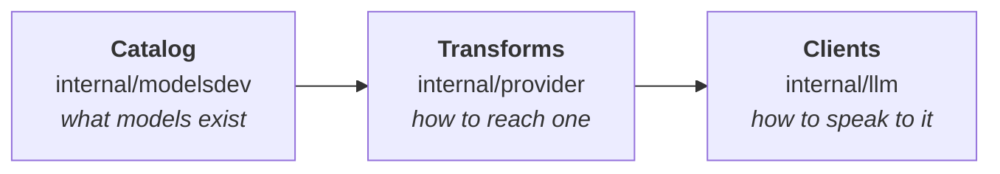
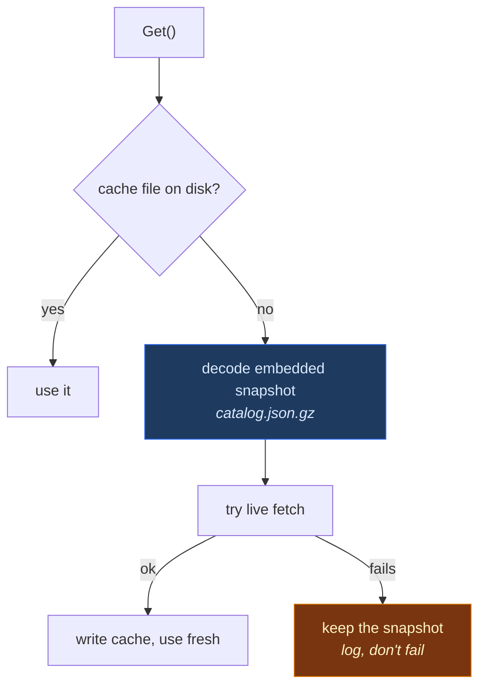
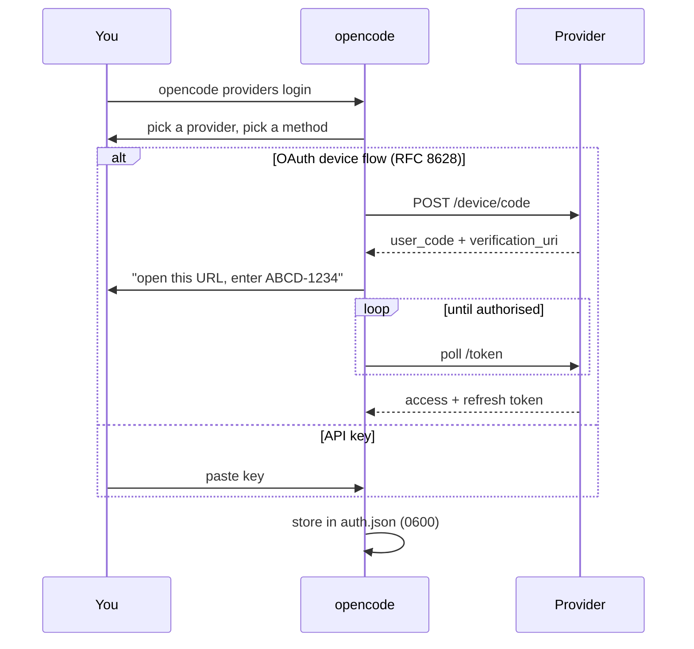
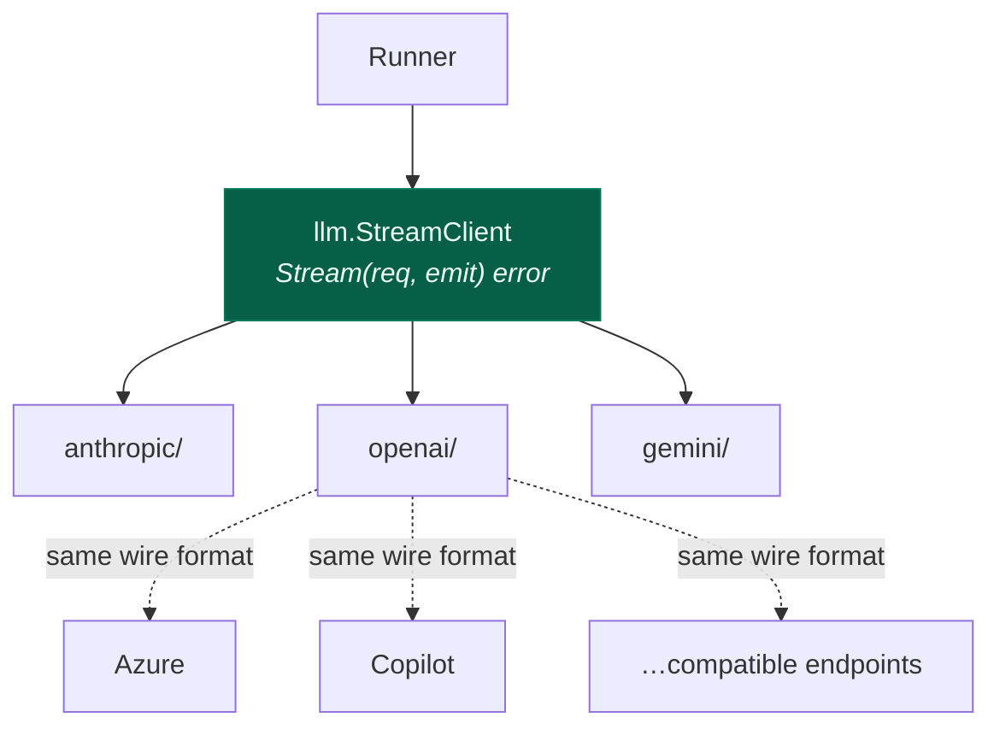

# 4. Providers & models

[← Session runner](03-session-runner.md) · [Index](README.md) · [Next: Tools →](05-tools-and-permissions.md)

---

Three concerns, deliberately kept separate:



A model you can *name* (catalog), *authenticate to* (transform), and *stream
from* (client) are three different problems. Conflating them is why provider
support usually rots.

## The catalog

Model metadata — context limits, pricing, capabilities — comes from
[models.dev](https://models.dev). Fetching it at startup would make the tool
unusable offline, so there are three sources in strict order:



The **embedded snapshot** is `catalog.json.gz`, compiled into the binary with
`//go:embed` — 4.2 MB of JSON compressed to about 431 KB. A brand-new install
on an air-gapped machine still knows every model's context window and price.

`Refresh` re-fetches when the cache is older than the TTL, and
`StartBackgroundRefresh` does it off the startup path so a slow network never
delays the first prompt.

> **Failure is never fatal here.** A fetch error logs and falls back. The
> catalog is metadata; being slightly stale is vastly better than not starting.

## Transforms

A **transform** adapts one provider's quirks onto the generic client. The
registry lives in `internal/provider/transform.go`, and each provider
implements only the interfaces it needs:

| Interface | Answers |
|---|---|
| `Transform` | how do I build a request for this provider? |
| `AuthProvider` | how does a user log in? |
| `ModelSource` | what models does this account actually have? |
| `Refresher` | how do I renew an expiring token? |
| `CatalogOverlay` | what does this provider change about catalog entries? |

Implemented transforms:

| File | Handles |
|---|---|
| `transform_anthropic.go` | Anthropic direct + OAuth |
| `transform_openai.go` | OpenAI and OpenAI-compatible endpoints |
| `transform_azure.go` | Azure deployment-name URL shape |
| `transform_copilot.go` | GitHub Copilot — device flow, live model list |
| `transform_snowflake.go` | Snowflake Cortex |
| `transform_opencode.go` | the opencode hosted gateway |

`ApplyOverlays` composes them: a provider can rewrite base URLs, inject
headers, add models, or hide models it can't serve — without the generic client
knowing any provider names.

### A caching lesson worth keeping

`transform_copilot.go` carries a comment about a real regression. Copilot needs
a live model list, and the naive placement of that call — inside `Apply`, which
`Fallback` invokes in a loop — added ~140 ms to *every request*.

The fix was a TTL cache keyed on **base URL and token together**:

```go
key := baseURL + "\x00" + token
```

Keying on the URL alone would serve one account's model list to another. The
cache also stores *failures* deliberately: without that, an unreachable Copilot
endpoint would be retried on every single request.

## Authentication

Three method types (`authmethods.go`):

| Type | Flow | Stored |
|---|---|---|
| `env` | read an environment variable | nothing |
| `key` | paste an API key | the key, in `auth.json` |
| `oauth` | browser or device-code flow | access + refresh + expiry |



OAuth implementations use **PKCE** (RFC 7636) where the provider supports it,
so the flow is safe on a shared machine.

### Token refresh

`ResolveCredential` refreshes inside a **five-minute window** before expiry
rather than on expiry. A token that passes the check at request-build time but
dies mid-stream produces a confusing mid-turn failure; the window makes that
essentially impossible.

### Login prompts

`WithLoginPrompt(ctx, fn)` puts the "open this URL / enter this code" callback
in the context. The CLI prints it; the TUI renders it in a dialog. The OAuth
code itself doesn't know which is attached, so one implementation serves both
front ends.

## Clients

`internal/llm` holds one package per **wire format**, not per vendor:



The interface is deliberately tiny:

```go
type StreamClient interface {
    Stream(ctx context.Context, request Request, emit func(StreamEvent)) error
}
```

One turn, events out through `emit`, error on failure. Everything
provider-specific — retries, header shapes, reasoning-block encoding — lives
behind it. This is why the runner has no provider branches.

`StreamEvent` carries text deltas, reasoning deltas, tool calls, usage, cost
and errors through a single channel, in the order the provider produced them.

### Provider-executed tools

Some providers run tools server-side (web search, most commonly). Those arrive
with `ProviderExecuted: true` and `Output` already filled:

```go
// ProviderExecuted marks a tool the provider ran server-side.
// The runner must not dispatch it locally; Output already carries the result.
```

Missing this flag would mean re-running a search locally and disagreeing with
what the model already saw.

## Adding a provider

If it speaks an existing wire format, you usually need no Go code — just
config:

```jsonc
{
  "provider": {
    "my-gateway": {
      "npm": "@ai-sdk/openai-compatible",
      "options": { "baseURL": "https://gateway.internal/v1" },
      "models": { "my-model": { "name": "My Model" } }
    }
  }
}
```

Write a transform only when the provider needs something structural — a
different auth dance, a URL shape the generic client can't express, or a live
model list. Start from `transform_openai.go`, which is the thinnest one.

---

[← Session runner](03-session-runner.md) · [Index](README.md) · [Next: Tools →](05-tools-and-permissions.md)
