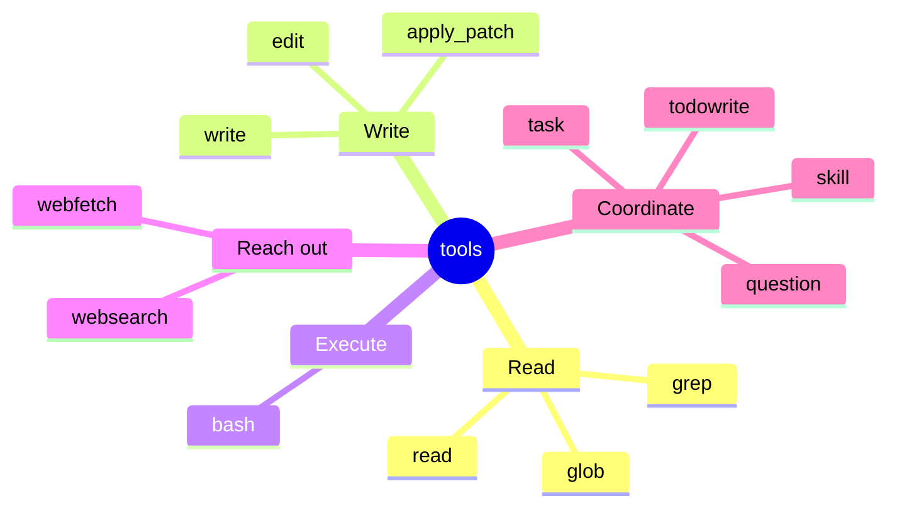
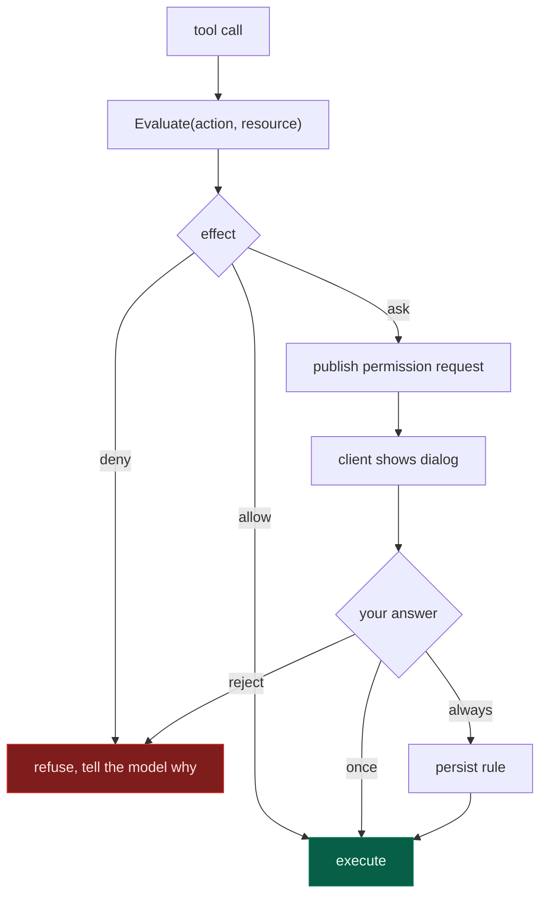
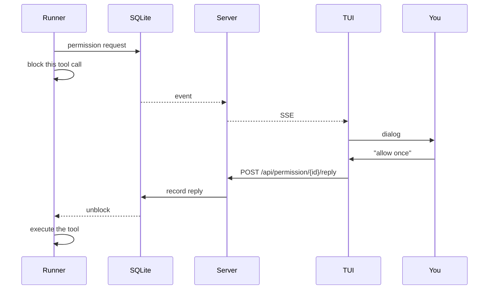

# 5. Tools & permissions

[← Providers](04-providers.md) · [Index](README.md) · [Next: The TUI →](06-tui.md)

---

Tools are how the agent touches the world. Permissions are what stop it.

## The tool contract

Four methods (`internal/tool/registry.go`):

```go
type Tool interface {
    Name() string
    Description() string
    InputSchema() map[string]any     // JSON Schema, sent to the model
    Execute(ctx context.Context, input map[string]any) (string, error)
}
```

`Description` and `InputSchema` are **prompt engineering**, not documentation —
they are literally what the model reads to decide whether and how to call the
tool. A vague description produces a misused tool.

Tools needing to know which session called them implement an optional second
interface:

```go
type SessionAware interface {
    ExecuteWithContext(ctx context.Context, input map[string]any, exec ExecContext) (string, error)
}
```

`todowrite` uses this — a todo list belongs to a session, and the base
interface deliberately doesn't leak session identity to tools that don't need
it.

The registry advertises tools in **sorted order** (`Names()`), so the prompt
sent to the model is byte-identical across runs. That matters for provider-side
prompt caching: unstable ordering would miss the cache on every request.

## The built-ins

13 tools, registered by `builtins.RegisterWith`:



| Tool | Does | Notes |
|---|---|---|
| `read` | read a file | line-numbered; reports LSP diagnostics after |
| `write` | create/overwrite | diagnostics after |
| `edit` | exact string replacement | fails if the target isn't unique |
| `apply_patch` | multi-hunk structured patch | for larger coordinated edits |
| `glob` | find files by pattern | `doublestar`, honours ignore rules |
| `grep` | search file contents | |
| `bash` | run a command | permission-gated, see below |
| `webfetch` | fetch a URL | |
| `websearch` | search the web | |
| `task` | spawn a sub-agent | its own session; see [runner](03-session-runner.md) |
| `todowrite` | maintain a task list | session-scoped |
| `skill` | load a skill's instructions | |
| `question` | ask you a question | blocks the turn on your answer |

Registration is conditional — `todowrite` needs a database, `skill` needs a
skill registry, `question` needs an asker, and the plan tools need an agent
switcher. A headless run without a UI simply doesn't advertise `question`,
rather than advertising a tool that would hang.

## The permission engine

Three effects, and a default that matters:

```go
Allow  Effect = "allow"
Deny   Effect = "deny"
Ask    Effect = "ask"
```

Evaluation (`permission.Evaluate`) walks every ruleset and returns the **last**
match — later rules override earlier ones — falling back to **`Ask`** when
nothing matches:

```go
if match == nil {
    return Rule{Action: action, Resource: "*", Effect: Ask}
}
```

Unknown means ask. A tool nobody wrote a rule for prompts rather than silently
proceeding.



A denial fails *the tool call*, not *the turn*. `Engine.Assert` returns an
error, `executeTool` propagates it, and the runner publishes `tool.failed`
carrying the reason. The model reads that as a failed tool and can try another
approach — the session does not abort.

### Defaults

```go
{Action: "*",                  Resource: "*",             Effect: Allow},
{Action: ExternalDirectoryAction, Resource: "*",          Effect: Ask},
{Action: "read",               Resource: "*.env",         Effect: Ask},
{Action: "read",               Resource: "*.env.*",       Effect: Ask},
{Action: "read",               Resource: "*.env.example", Effect: Allow},
```

Read as a sequence: permissive by default, then carve out the dangerous cases.
Leaving the working directory asks. Reading `.env` asks — but `.env.example`,
which is committed and contains no secrets, doesn't.

An agent with no permission configuration at all gets
`MissingAgentPermissions` — deny everything. A misconfigured agent is inert,
not omnipotent.

### `external_directory`

This is the guard that took real work to get right. A tool reaching outside the
working directory must ask — but "outside" is harder than it looks:

```sh
cat > /tmp/x.go        # obviously outside
cd /tmp && cat > x.go  # the cd hides it
cat > ../../etc/hosts  # relative escape
```

`internal/tool/builtins/shellscan.go` parses the command with
[`mvdan.cc/sh/v3/syntax`](https://pkg.go.dev/mvdan.cc/sh/v3/syntax) — a real
shell parser, not a regex — and walks the AST for path arguments to commands in
`pathCommands`.

Both the root and the candidate path are **canonicalised** before comparison,
which on macOS matters more than you'd expect: `/var` is a symlink to
`/private/var`, so a naive prefix check lets `/var/...` escape a
`/private/var/...` root.

> This was a real reported bug: bash wrote outside the working directory
> without prompting. Regexes cannot fix it, because the shell grammar decides
> what a path even is.

### Rules from config

```jsonc
{
  "permission": {
    "bash": "ask",
    "external_directory": "ask",
    "read": { "*.env": "ask", "*.env.example": "allow" },
    "webfetch": "allow"
  }
}
```

Rules can also be persisted at runtime — answering "always allow" writes to the
`permission` table, scoped to the project.

## The permission round trip

Permissions are asynchronous. The runner publishes a request and waits; some
client answers over HTTP:



Because it round-trips through the store, **any** client can answer — the TUI,
a script hitting the API, a web UI. And the request survives a client
disconnect: reconnect and the dialog is still there.

`--auto` (aliases `--yolo`, `--dangerously-skip-permissions`) drops the gate
entirely by setting `stack.Runner.Permissions = nil`. It is exactly as
dangerous as it sounds and is meant for throwaway containers.

## Writing a tool

```go
type MyTool struct{}

func (t *MyTool) Name() string        { return "my_tool" }
func (t *MyTool) Description() string { return "Does the thing. Use when..." }

func (t *MyTool) InputSchema() map[string]any {
    return map[string]any{
        "type": "object",
        "properties": map[string]any{
            "target": map[string]any{
                "type": "string",
                "description": "What to operate on",
            },
        },
        "required": []string{"target"},
    }
}

func (t *MyTool) Execute(ctx context.Context, input map[string]any) (string, error) {
    target, _ := input["target"].(string)
    return "did the thing to " + target, nil
}
```

Then `registry.Register(&MyTool{})` in `builtins.go`.

Three things to get right:

1. **Return errors as errors.** The runner turns them into `tool.failed` events
   and shows the model the message — so write messages *for the model*.
2. **Respect `ctx`.** Cancellation is how interrupt works; a tool ignoring it
   blocks Ctrl-C.
3. **Go through `Resolver`** for filesystem access, so path restrictions and
   the `external_directory` gate apply. Bypassing it bypasses permissions.

---

[← Providers](04-providers.md) · [Index](README.md) · [Next: The TUI →](06-tui.md)
