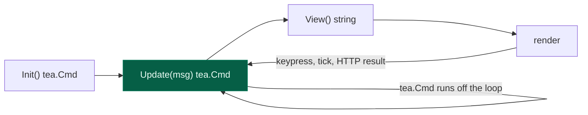
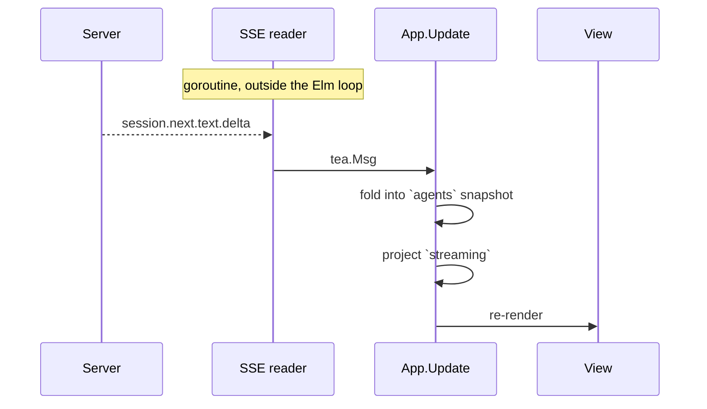
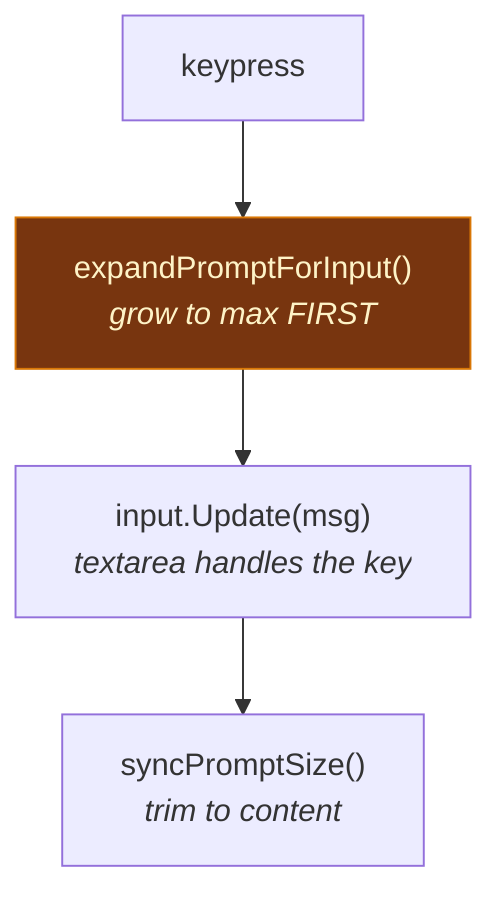

# 6. The TUI

[← Tools & permissions](05-tools-and-permissions.md) · [Index](README.md) · [Next: Configuration →](07-configuration.md)

---

`internal/tui` is the largest package in the codebase — ~11,000 lines across 30
files. It is built on [Bubble Tea v2](https://charm.land) and talks to the core
only over HTTP.

## The Elm loop

Bubble Tea is The Elm Architecture: state, messages, update, view.



The rule that shapes everything: **`Update` must not block.** Anything slow —
an HTTP call, a clipboard read — is returned as a `tea.Cmd`, which the runtime
runs on its own goroutine and delivers back as a message. Blocking in `Update`
freezes the interface, including the key handler.

## State

`App` (`app.go`) holds it all. The interesting fields:

| Field | Holds |
|---|---|
| `client` | HTTP client for the core |
| `view`, `width`, `height` | which screen, and terminal size |
| `sessions`, `active`, `timeline` | conversation state |
| `streaming` | live assistant text, keyed by assistant message ID |
| `agents` | aggregated snapshot including sub-agent sessions |
| `input` | the `textarea` model |
| `autocomplete` | inline `/` and `@` popup state |
| `busy`, `scrollOffset`, `leaderArmed` | interaction state |

Two comments in that struct record real bugs:

```go
// streaming holds the ACTIVE session's live assistant text, projected out
// of the latest snapshot. It is never written from an event directly:
// with subagents running, a child's deltas must not land here.
```

Sub-agents stream concurrently with the parent. Writing deltas straight from
events interleaves a child's output into the parent's message. The fix is to
project from the snapshot, keyed by message ID.

## Data flow



The SSE connection is read on its own goroutine and events are injected as
messages. `aggregator.go` folds the event stream into a `Snapshot` — one node
per session, sub-agents included — so the view renders from one coherent
structure instead of chasing partial updates.

`dropped` counts events lost to a full channel. A slow terminal must degrade by
dropping frames, never by applying back-pressure to the runner.

## Rendering

| File | Renders |
|---|---|
| `views.go` | top-level screens (home, chat) |
| `render.go` | messages, tool calls, diffs |
| `markdown.go` | assistant prose via Glamour |
| `dialogs*.go` | modal dialogs — model picker, provider, confirm |
| `autocomplete.go` | the inline `/` and `@` popup |
| `footer.go` | status line — model, tokens, cost, LSP |
| `styles.go` | theme-derived Lipgloss styles |
| `dim.go` | backdrop dimming behind dialogs |

### The autocomplete is not a dialog

`autocomplete.go` opens with a note about a port that was initially wrong:

> The original is not a dialog. It is an absolutely-positioned box anchored
> directly above the prompt — same left edge, same width, at most ten rows […]
> It also does not have a filter field of its own: what you type keeps going
> into the prompt, and the list narrows against the text after the trigger.

The first port reused the centred modal surface, which has a title, a search
row and a footer — and read as a completely different component. Worth
remembering: matching *behaviour* isn't enough when the shape is the
recognisable part.

## Prompt sizing

`promptsize.go` is small and was hard to get right. The prompt grows as you
type and must never hide the first line.



Expanding **before** the textarea sees the key is the whole trick. If the box
is still one row tall when the key lands, the textarea scrolls its viewport to
keep the cursor visible — and that scroll is what hid the first line. Growing
first means there is always room, so no scroll ever happens; `syncPromptSize`
then trims back to the content height.

Height is capped at `max(6, height/3)`.

> **A testing lesson.** The first tests for this passed while the bug was
> fully present, because they used `SetValue` to construct state — which skips
> `input.Update()`, and therefore skips the viewport scroll that *was* the
> bug. A test that builds state directly instead of driving the real input
> path can pass exhaustively against broken code.

## Paste

`paste.go` handles bracketed paste, with two behaviours worth knowing:

- **Line endings are normalised.** Windows terminals and ConPTY send `\r` or
  `\r\n` inside a paste; left alone those become one line with embedded
  carriage returns.
- **Large pastes collapse.** Over 150 characters or 3 lines, the prompt shows
  `[Pasted ~40 lines]` instead of the content. The real text is stored in
  `app.pastes` and `expandPastes` restores it on submit. Deleting the
  placeholder drops the content with it.

`paste_attach.go` handles pasted images, which become file attachments.

## Keybindings

`keys.go`. There is a leader key (`leaderArmed`), so sequences like
`<leader> s` work rather than requiring ever-more-obscure Ctrl combinations.

Dialogs used to open with a visible delay on Ctrl-key combinations — the cause
was work happening inside `Update` rather than in a `tea.Cmd`.

## Themes

`theme.Theme` carries semantic colours (`Text`, `TextMuted`, `Primary`,
`Border`, `BackgroundElement`, `BackgroundMenu`, …) rather than literal ones,
so a component asks for "muted text" and the theme decides. Default is
`gocode-dark`; set `"theme"` in config.

## The mini interface

`--mini` runs a reduced interface for narrow terminals and CI. It replays
session history on resize, which `--no-replay` and `--replay-limit` control.

---

[← Tools & permissions](05-tools-and-permissions.md) · [Index](README.md) · [Next: Configuration →](07-configuration.md)
