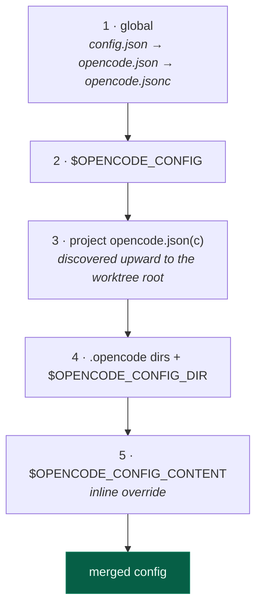

# 7. Configuration

[← The TUI](06-tui.md) · [Index](README.md) · [Next: HTTP API →](08-http-api.md)

---

Config is JSONC — JSON with comments and trailing commas — deep-merged from
several sources.

## Precedence

Later sources win, merged key by key (`internal/config/loader.go`):



Global lives under `$XDG_CONFIG_HOME/opencode/` (`~/.config/opencode/` by
default).

Two behaviours worth knowing:

- **Project config is discovered upward** to the worktree root, so running in
  `repo/src/deep/dir` still picks up `repo/opencode.json`.
- **Errors in global config are tolerated**; errors in project config are not.
  A broken file in your home directory shouldn't make every project unusable,
  but a broken file in *this* project should be reported rather than silently
  half-applied.

`OPENCODE_DISABLE_PROJECT_CONFIG=1` skips project sources entirely.

The merge is a **deep merge**: setting one key under `permission` in project
config doesn't discard the global `permission` block.

## Variable substitution

Two token forms, applied before parsing:

```jsonc
{
  "provider": {
    "mine": {
      "options": {
        "apiKey": "{env:MY_API_KEY}",        // from the environment
        "baseURL": "{file:./endpoint.txt}"   // from a file
      }
    }
  }
}
```

| Token | Resolves | Missing |
|---|---|---|
| `{env:VAR}` | process environment | empty string |
| `{file:path}` | file contents, relative to the config file's directory, `~/` expanded | **error** |

The asymmetry is deliberate: an unset environment variable is a normal
condition, but a config pointing at a file that isn't there is a mistake.

Keeping secrets in `{env:...}` is what lets `opencode.json` be committed.

## Reference

```jsonc
{
  "$schema": "https://opencode.ai/config.json",

  // ── models ──────────────────────────────────────────────
  "model": "anthropic/claude-sonnet-5",
  "small_model": "anthropic/claude-haiku-4-5",  // titles, summaries
  "default_agent": "build",

  // ── interface ───────────────────────────────────────────
  "theme": "opencode-dark",
  "username": "you",
  "shell": "/bin/zsh",
  "keybinds": { "leader": "ctrl+x" },

  // ── behaviour ───────────────────────────────────────────
  "autoupdate": "notify",     // true | false | "notify"
  "share": "manual",
  "autoshare": false,
  "subagent_depth": 1,
  "instructions": ["./docs/conventions.md"],

  // ── providers ───────────────────────────────────────────
  "disabled_providers": ["openai"],
  "enabled_providers": ["anthropic"],
  "provider": { /* see below */ },

  // ── capability ──────────────────────────────────────────
  "permission": { "bash": "ask", "external_directory": "ask" },
  "tools": { "websearch": false },
  "lsp": { /* see below */ },
  "mcp": { /* see below */ },
  "agent": { /* see below */ },
  "command": { /* see below */ },

  "experimental": {}
}
```

### `model` and `small_model`

Format is `provider/model`. `small_model` is used for cheap background work —
session titles, summaries — so those don't burn frontier-model tokens.

### `instructions`

Extra files appended to the system prompt. Combine with `AGENTS.md` in the
project root for per-repo conventions.

### `permission`

See [Tools & permissions](05-tools-and-permissions.md). Two forms:

```jsonc
"permission": {
  "bash": "ask",                                  // whole tool
  "read": { "*.env": "ask", "*.env.example": "allow" }   // per resource
}
```

### `provider`

```jsonc
"provider": {
  "my-gateway": {
    "npm": "@ai-sdk/openai-compatible",
    "name": "Internal Gateway",
    "options": {
      "baseURL": "https://gateway.internal/v1",
      "apiKey": "{env:GATEWAY_KEY}",
      "timeout": 60000
    },
    "models": {
      "my-model": { "name": "My Model", "limit": { "context": 128000 } }
    }
  }
}
```

`whitelist` / `blacklist` filter which catalog models a provider exposes.
Unknown keys under `options` are **preserved** and passed through — see
`ProviderOptions.UnmarshalJSON`, which keeps them in `Extra` specifically so
provider-specific settings survive a round trip.

### `lsp`

```jsonc
"lsp": {
  "gopls": { "disabled": false },
  "my-server": {
    "command": ["my-lsp", "--stdio"],
    "extensions": [".mylang"]
  }
}
```

> **A parsing trap, fixed and worth remembering.** `"lsp": null` once disabled
> LSP entirely. `json.Unmarshal("null", &someBool)` *succeeds* and leaves the
> bool at `false`, and the code computed `off = !false`. A null that means
> "absent" and a false that means "enabled" are not the same thing.

### `mcp`

```jsonc
"mcp": {
  "github":  { "type": "local",  "command": ["gh-mcp"], "env": { "TOKEN": "{env:GH}" } },
  "remote":  { "type": "remote", "url": "https://mcp.example.com/sse" }
}
```

### `agent`

Agents are named configurations — model, prompt, permissions, tool set:

```jsonc
"agent": {
  "reviewer": {
    "description": "Reviews code without changing it",
    "model": "anthropic/claude-sonnet-5",
    "prompt": "You review code. Never edit files.",
    "tools": { "write": false, "edit": false, "bash": false },
    "permission": { "*": "deny", "read": "allow" }
  }
}
```

Equivalently as markdown in `.opencode/agent/reviewer.md`, with the same fields
as YAML frontmatter and the body as the prompt. Both forms accept exactly the
same shapes.

An agent with **no** permission block gets `MissingAgentPermissions` — deny
everything — rather than inheriting a permissive default.

### `command`

Custom slash commands:

```jsonc
"command": {
  "commit": {
    "template": "Commit the staged changes. Message hint: $ARGUMENTS",
    "description": "write a commit"
  }
}
```

Or as markdown under `.opencode/command/`, where nesting namespaces them:
`command/git/commit.md` becomes `/git/commit`.

Template substitution (`internal/command/expand.go`):

| Token | Expands to |
|---|---|
| `$1`, `$2`, … | positional arguments |
| `$ARGUMENTS` | the whole raw argument string |
| `` !`cmd` `` | the command's output |

The **highest-numbered** placeholder is greedy — it takes its argument and
every one after it, so `/commit $1` with three words gets all three rather
than only the first. If a template uses no placeholders at all and you pass
arguments anyway, they are appended after a blank line, so typing them is never
silently ignored.

`` !`cmd` `` substitutions are bounded at 30 s and substitute *empty* on
failure, so a template referencing a tool you don't have still produces a
usable prompt.

## Where files live

Paths follow the XDG spec (`internal/global/global.go`):

| Path | Holds |
|---|---|
| `$XDG_CONFIG_HOME/opencode/` | `opencode.json`, `auth.json` |
| `$XDG_DATA_HOME/opencode/` | `opencode.db`, `log/`, `repos/` |
| `$XDG_CACHE_HOME/opencode/` | models.dev cache, `bin/` |
| `$XDG_STATE_HOME/opencode/` | per-directory state (last model, …) |
| `./.opencode/` | project agents, commands, skills |
| `./AGENTS.md` | project instructions |

On macOS and Linux these default to `~/.config`, `~/.local/share`,
`~/.cache`, `~/.local/state`.

---

[← The TUI](06-tui.md) · [Index](README.md) · [Next: HTTP API →](08-http-api.md)
