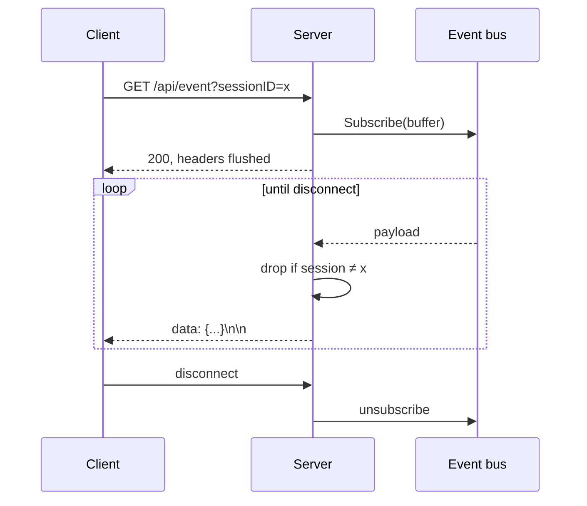

# 8. HTTP API

[← Configuration](07-configuration.md) · [Index](README.md) · [Next: LSP & MCP →](09-integrations.md)

---

The API is the only entry to the core. The TUI uses nothing else, so anything
the TUI can do, a script can do.

```sh
gocode serve --port 4096
```

Binds `127.0.0.1` by default. `--hostname 0.0.0.0` exposes it —
**there is no authentication**, so only do that on a trusted network or behind
a proxy that adds it.

## Shape

- JSON in, JSON out
- Errors are `{"error": "message"}` with a matching status
- `GET /api/event` is Server-Sent Events; everything else is request/response
- Path parameters use Go 1.22+ `ServeMux` patterns (`/api/session/{sessionID}`)

## Sessions

| Method | Path | Does |
|---|---|---|
| `GET` | `/api/session` | list sessions |
| `POST` | `/api/session` | create one |
| `GET` | `/api/session/{id}` | fetch one |
| `DELETE` | `/api/session/{id}` | delete it |
| `GET` | `/api/session/{id}/children` | sub-agent sessions |
| `POST` | `/api/session/{id}/fork` | branch from this point |
| `POST` | `/api/session/{id}/rename` | retitle |
| `GET` | `/api/session/{id}/message` | full history |
| `POST` | `/api/session/{id}/prompt` | **send input** |
| `POST` | `/api/session/{id}/interrupt` | stop the current turn |
| `POST` | `/api/session/{id}/compact` | compact now |
| `POST` | `/api/session/{id}/model` | switch model |
| `POST` | `/api/session/{id}/agent` | switch agent |
| `POST` | `/api/session/{id}/background` | run in background |
| `GET` | `/api/session/{id}/stats` | tokens and cost |
| `GET` | `/api/session/{id}/todo` | todo list |

### Sending a prompt

```http
POST /api/session/ses_abc123/prompt
Content-Type: application/json

{
  "text": "add a health check endpoint",
  "delivery": "queue",
  "files": []
}
```

```json
{ "messageID": "msg_def456" }
```

Returns as soon as the input is **durably admitted** — not when the work is
done. Watch `/api/event` for progress. This is the inbox from
[Data model](02-data-model.md) surfacing directly in the API.

`delivery` is `queue` (wait for the current request to finish) or `steer`
(join the current request at the next step boundary).

A message with only `files` and no `text` is valid — the handler requires text
only when there is nothing else to send:

```go
// A message carrying only an attachment is legitimate; text is required
// only when there is nothing else to send.
```

## Events

```http
GET /api/event
GET /api/event?sessionID=ses_abc123
```

```
data: {"type":"session.next.text.delta","session":"ses_abc","data":{...}}

data: {"type":"session.next.tool.called","session":"ses_abc","data":{...}}
```

Standard SSE — `text/event-stream`, `no-cache`, flushed per event, held open
until the client disconnects. `sessionID` filters server-side, which matters
when many sessions are active.

Event types are exactly the durable events from
[Data model](02-data-model.md).



Subscriptions are buffered. A client too slow to keep up **loses events** — it
cannot slow the runner down. Clients that must not miss anything should
reconcile with `GET /api/session/{id}/message` on reconnect.

## Permissions & questions

| Method | Path | Does |
|---|---|---|
| `GET` | `/api/permission/request` | pending requests |
| `POST` | `/api/permission/{id}/reply` | answer one |
| `GET` | `/api/session/{id}/permission` | pending for a session |
| `POST` | `/api/session/{id}/permission/{requestID}/reply` | answer, session-scoped |
| `GET` | `/api/question` · `/api/session/{id}/question` | pending questions |
| `POST` | `/api/question/{id}/reply` · `/api/question/{id}/reject` | answer or decline |

This is the round trip that makes permission dialogs work from any client —
see [Tools & permissions](05-tools-and-permissions.md).

## Providers & models

| Method | Path | Does |
|---|---|---|
| `GET` | `/api/provider` | configured providers |
| `GET` | `/api/model` | available models |
| `GET` | `/api/provider/{id}/auth` | auth status |
| `POST` | `/api/provider/{id}/auth` | store a credential |
| `DELETE` | `/api/provider/{id}/auth` | log out |
| `POST` | `/api/provider/auth/oauth` | begin an OAuth flow |
| `GET` | `/api/provider/auth/oauth/{attemptID}` | poll it |

OAuth is two-step because device flow is inherently asynchronous: start an
attempt, get a URL and code to show the user, then poll until they finish.

## Everything else

| Method | Path | Does |
|---|---|---|
| `GET` | `/api/health` | liveness — the only route with no session service |
| `GET` | `/api/agent` | configured agents |
| `GET` | `/api/command` | slash commands |
| `GET` | `/api/skill` | skills |
| `GET` | `/api/lsp` | language server status |
| `GET` | `/api/mcp` | MCP server status |
| `GET` | `/api/job` | background jobs |

`Mux()` with no session service returns a **health-only** route tree, for
callers that just need a liveness probe.

## A worked example

```sh
BASE=http://127.0.0.1:4096

# create a session
SID=$(curl -sX POST $BASE/api/session | jq -r .id)

# watch it (background)
curl -sN "$BASE/api/event?sessionID=$SID" | \
  while read -r line; do echo "${line#data: }" | jq -c '.type'; done &

# send work
curl -sX POST $BASE/api/session/$SID/prompt \
  -H 'content-type: application/json' \
  -d '{"text":"list the go files","delivery":"queue"}'

# what did it cost
curl -s $BASE/api/session/$SID/stats | jq
```

## Client library

`internal/tui/client` wraps all of this in Go and is what the TUI uses. If you
are building a Go client, start there rather than hand-rolling requests — it
already handles the SSE stream and the event wire format.

---

[← Configuration](07-configuration.md) · [Index](README.md) · [Next: LSP & MCP →](09-integrations.md)
