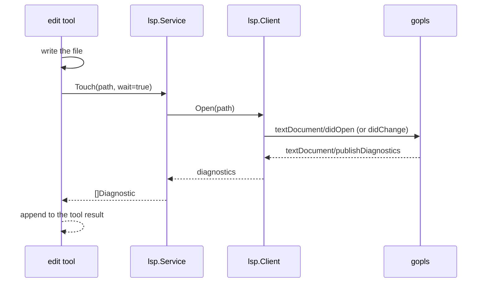
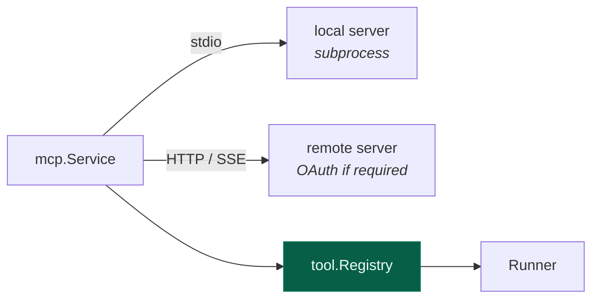
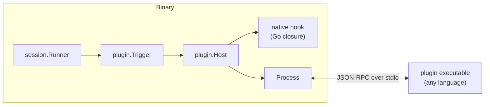

# 9. LSP, MCP & plugins

[← HTTP API](08-http-api.md) · [Index](README.md) · [Next: Development →](10-development.md)

---

Three ways the outside world reaches in. LSP makes the agent's edits *correct*;
MCP adds tools it can call; plugins change how the agent itself behaves.

## LSP

The agent edits code. Without a language server it finds out an edit was wrong
when the build fails — several steps later. With one, it finds out immediately.



The model sees `internal/x.go:42:5: undefined: foo` in the same tool result as
"wrote the file". It fixes it on the next step rather than three steps later.

### Wire protocol

`jsonrpc.go` implements JSON-RPC 2.0 over `Content-Length`-framed stdio — the
same framing an editor uses. Servers are ordinary subprocesses.

`client.go` handles the `initialize` handshake, document sync, and
`publishDiagnostics` notifications.

### Two races, and their fixes

Both were real, both cost real debugging time, and both are still guarded by
tests.

**1. Waiting on a file that didn't change.** `Open` now reports whether it
actually sent anything:

```go
func (c *Client) Open(path string) (changed bool, err error)
```

If the document is unchanged, no notification goes out — so no diagnostics are
published — so a waiter blocks until timeout. The LSP test suite took 21
seconds because of exactly this: a 5-second stall per unchanged file. The
caller now skips the wait when nothing was sent.

**2. Diagnostics arriving before the waiter registered.** A fast server can
publish before `WaitForDiagnostics` is called, and the waiter then waits for an
event that already happened. Fixed with a sequence snapshot:

```go
seq := client.PublishSeq(path)      // snapshot BEFORE the edit
// ... make the change ...
client.WaitForDiagnostics(ctx, path, seq)   // "anything newer than seq"
```

Asking for "a publish newer than `seq`" is immune to ordering; asking for "the
next publish" is not.

### Server registry

`servers.go` declares 28 servers with the extensions they handle and how to
find them:

```
gopls · typescript · rust · pyright · ruff · clangd · zls · lua-ls · bash
terraform · dart · ocaml-lsp · gleam · nixd · clojure-lsp · elixir-ls
haskell-language-server · yaml-ls · json-ls · texlab · svelte · astro
prisma · dockerfile · csharp · kotlin-ls · sourcekit-lsp · mdlsp
```

Clients spawn **lazily**, on first touch of a matching file, and are keyed by
`root + serverID` — a monorepo with several Go modules gets one `gopls` per
root, not one shared instance with the wrong workspace.

> **Deliberate divergence from upstream.** The TypeScript version can `npm
> install` a missing language server at runtime. This port does not: it uses
> servers already on your `PATH`. Downloading and executing code at runtime is
> a different security posture, and a single static binary that silently grows
> an `npm` dependency isn't one.

Add your own in config:

```jsonc
"lsp": {
  "my-server": { "command": ["my-lsp", "--stdio"], "extensions": [".mylang"] }
}
```

Status shows in the TUI footer and at `GET /api/lsp`.

### mdlsp: the markdown language server

The repo also ships the other side of the protocol: `mdlsp`, a standalone LSP
*server* for markdown documents (`cmd/mdlsp`, actor core in `internal/mdlsp`).
It is a general editor tool, built from the same parts as the client — and, as
of the registry entry above, one the agent connects to as well: touch a `.md`
file and gocode starts it like any other server, provided it is on `PATH`.

| Package | Role |
|---|---|
| `internal/jsonrpc` | The Content-Length-framed JSON-RPC connection, shared by client and server. Originally client-only in `internal/lsp`. |
| `internal/lspprotocol` | Wire types both sides speak. `internal/lsp` aliases them. |
| `internal/mddoc` | The markdown model: goldmark AST walk producing headings, slugs, link spans, code blocks, frontmatter, plus byte↔UTF-16 position mapping. |
| `internal/mdlsp` | The server. All state lives on one actor goroutine — handlers post closures over a channel and wait on reply channels; no mutexes. |

Features: heading outline (`documentSymbol`), folding ranges, go-to-definition
for `#anchor`, `file.md#anchor` and `[[Wiki]]` links, find-references,
heading rename (rewrites every inbound anchor), completion (anchors, wiki
names, file paths), clickable document links, diagnostics for broken links,
formatting (whitespace only), and workspace-wide symbol search.

```sh
make mdlsp          # builds cmd/mdlsp/mdlsp
make install-mdlsp  # installs it to $GOPATH/bin, where gocode finds it
```

A Homebrew install ships it too: the formula puts `mdlsp` on `PATH` next to
`gocode` and registers it in the global config, pinned to the `opt` path so an
upgrade does not leave the entry dangling. See [Install](../README.md#install).

Point any editor at the binary over stdio, e.g. Neovim:

```lua
vim.lsp.config("mdlsp", {
  cmd = { vim.fn.getcwd() .. "/cmd/mdlsp/mdlsp" },
  filetypes = { "markdown" },
})
```

## MCP

[Model Context Protocol](https://modelcontextprotocol.io) servers add tools
from outside the binary — a GitHub client, a database browser, an internal
service.

`internal/mcp` uses the official
[`modelcontextprotocol/go-sdk`](https://github.com/modelcontextprotocol/go-sdk)
for the wire protocol and OAuth. Only the persistence, status machine and CLI
surface are hand-ported — matching how the TypeScript version uses the
official TS SDK.

### Transports



```jsonc
"mcp": {
  "github": {
    "type": "local",
    "command": ["gh-mcp"],
    "env": { "GITHUB_TOKEN": "{env:GH_TOKEN}" }
  },
  "internal": {
    "type": "remote",
    "url": "https://mcp.corp.example/sse"
  }
}
```

### Tool namespacing

`ToolName(clientName, name)` prefixes every tool with its server
(`naming.go`), so two servers can both expose `search` without colliding. Names
are sanitised to what providers accept as tool identifiers.

Once registered, an MCP tool is a `tool.Tool` like any other — same registry,
same permission gate, same `tool.called` events. The runner cannot tell the
difference, which is the point.

### Remote auth

Remote servers may require OAuth. The SDK provides authorization-code flow with
PKCE, discovery and dynamic client registration; this package adds a
**persisting token source** so a refreshed token is written back rather than
being refreshed again on every start.

### Connection lifecycle

Servers are connected at boot and **reconnected with backoff** on failure. A
dead MCP server degrades the tool set; it does not stop gocode from starting.
`GET /api/mcp` and `gocode mcp` report status.

## Plugins

MCP adds tools. Plugins change *behavior*: what the model is told, what a tool
call runs with, what its result looks like, whether a permission is even asked.

### The shape, and why it survived the port

A TypeScript opencode plugin is a factory returning an object of optional
callbacks, and almost every callback looks the same:

```ts
"chat.params"?: (input, output) => Promise<void>
```

Read the input, **mutate the output in place**, return nothing. The host walks
its loaded plugins in load order and threads one output through all of them, so
a later plugin sees — and can override — an earlier one's edit.

That contract ports directly. Go has no in-place mutation of a value
parameter, so the output arrives as a pointer:

```go
plugin.On(hooks, plugin.ChatParams,
    func(ctx context.Context, in plugin.ChatInput, out *plugin.ChatParamsOutput) error {
        out.Temperature = plugin.Float(0.3)
        return nil
    })
```

Hooks are registered through `plugin.On` rather than as struct fields because
Go cannot express a field whose type varies per hook name. A `Definition[I, O]`
binds a wire name to its input and output types, which is what keeps a
subprocess's JSON and a Go closure describing the same hook.

### Two tiers

What could **not** port is `import()`. A Go binary is linked once; there is no
way to pull unknown code into the process. So the two loading paths TypeScript
has — a built-in array and a dynamic import — become two tiers:

| Tier | What it is | Ports |
|---|---|---|
| **Native** | A Go factory registered at init and compiled in | `internalPlugins()` |
| **Process** | A separate executable spoken to over stdio JSON-RPC | the dynamic `import()` |



Both tiers produce the same `plugin.Hooks` value, so `Trigger` — and every call
site in the runtime — cannot tell them apart. A process plugin's manifest names
the hooks it implements at handshake time, so the host pays a round trip only
for hooks that exist.

Auth and provider registrations are **native-only**. Every field on them is a
function the host calls back into, and an OAuth flow is a conversation, not a
request/response; modelling that across stdio would mean a callback channel
with no user yet.

### Loading

`plugin.Load` runs the native tier first, then the configured specs in config
order — deliberately, since built-ins establish defaults a user's plugin
overrides. A plugin that fails is reported and skipped; one bad plugin never
stops the others.

```json
{ "plugin": ["./tools/lint", ["review", { "strict": true }]] }
```

Both config forms from the TypeScript schema parse: a bare reference, or a
`[ref, options]` tuple whose options reach the factory.

Resolution looks in three places — the native registry, the filesystem
(relative to the session directory), then `$XDG_CONFIG_HOME/gocode/plugin/<name>`
(`~/.config/gocode/plugin/<name>`). There is no fourth. TypeScript's would be
npm, and **this port installs nothing at runtime** (see
[Development](10-development.md)); a name that is nowhere fails with "not
installed" rather than being fetched. A plugin directory declares how it runs
in `gocode-plugin.json`:

```json
{ "command": ["./plugin-echo"], "env": { "MODE": "ci" } }
```

### Installing and enabling

These are two different things, and conflating them is the most likely way to
be confused by a plugin that does nothing. **Copying a plugin does not enable
it** — it runs only when the config's `plugin` array names it, matching
upstream. An installed-but-unlisted plugin is inert.

The Makefile does both:

```sh
make plugin-root                        # print where plugins live
make install-plugin PLUGIN=./my-plugin  # copy + enable; NAME= overrides the id
make install-example-plugin             # build + install + enable plugin-echo
make uninstall-plugin NAME=my-plugin    # disable + remove
```

Enabling writes the entry into the **global** config
(`~/.config/gocode/gocode.json`), so plain `gocode` picks the plugin up in any
directory, with no per-project config and no flags. Pass `CONFIGURE=0` to
install the files and leave the config alone, or manage the entry separately:

```sh
make enable-plugin  NAME=plugin-echo OPTIONS='{"banner":"hi"}'
make disable-plugin NAME=plugin-echo    # leaves it installed
```

The config edit is done by `tools/pluginconfig.go` rather than by shell, so it
preserves every other key, is idempotent, writes atomically, and **refuses to
rewrite a file containing comments** rather than silently stripping them — it
prints what to add by hand instead.

An installed plugin is referred to by bare name, with no path:

```json
{ "plugin": [["plugin-echo", { "banner": "hi" }]] }
```

`make clean` deliberately leaves installed plugins alone — they are user state,
not build output. The install path is pinned by `TestInstallDir` so the
Makefile and `plugin.InstallRoot()` cannot drift apart.

### The hook catalog

Defined in `internal/plugin/hooks.go`, triggered where the decision is made:

| Hook | Fires at | Mutates |
|---|---|---|
| `config` | after config merge, before anything is built from it | the whole config |
| `event` | after every committed event (notification) | — |
| `chat.params` | request assembly | temperature, topP, max tokens, options |
| `chat.headers` | request assembly | request headers |
| `tool.definition` | tool advertisement | description, JSON Schema |
| `tool.execute.before` | before a tool runs | the call's arguments |
| `tool.execute.after` | after a tool settles | the result the model sees |
| `permission.ask` | before the user is interrupted | `ask` / `allow` / `deny` |
| `experimental.chat.system.transform` | system prompt assembly | the prompt blocks |
| `experimental.session.compacting` | before compaction | the compaction prompt |

`tool.execute.before` runs *before* the permission checks, not after: what a
call is allowed to touch is read off its arguments, so a rewritten path has to
be the one asked about.

### One deliberate divergence

TypeScript wraps each hook in `Effect.promise`, which turns a rejected hook
into a defect that aborts the turn — one broken third-party plugin can take
down the agent. `plugin.Trigger` reports the failure through the host's error
sink and continues; the output keeps every successful hook's edits. Callers
that need the strict behavior check the returned error, which the tool and
permission seams do.

### Writing one

[`examples/plugin-echo`](../examples/plugin-echo) is a complete process plugin
in ~150 lines, with the protocol written out. Nothing in it is Go-specific — a
plugin is an executable, not a library.

## Skills

Adjacent to all three: **skills** are markdown files describing a capability, loaded
on demand by the `skill` tool rather than sitting in the system prompt.

```
.gocode/skill/deploy.md
```

Discovered by `skill.Discover` and also exposed as slash commands — a skill
without a name collision becomes `/deploy`. Keeping them out of the system
prompt is what makes many skills affordable: they cost tokens only when used.

---

[← HTTP API](08-http-api.md) · [Index](README.md) · [Next: Development →](10-development.md)
