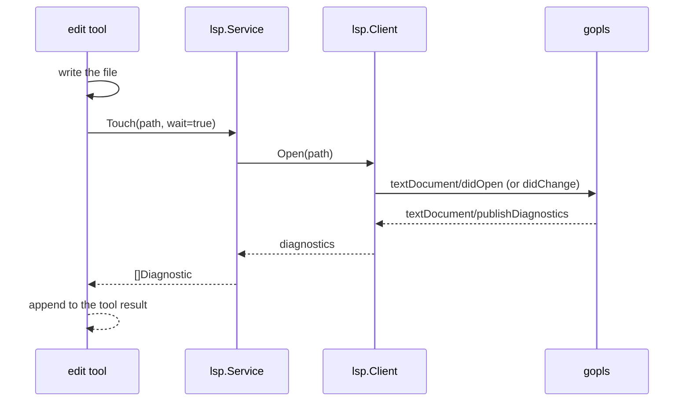
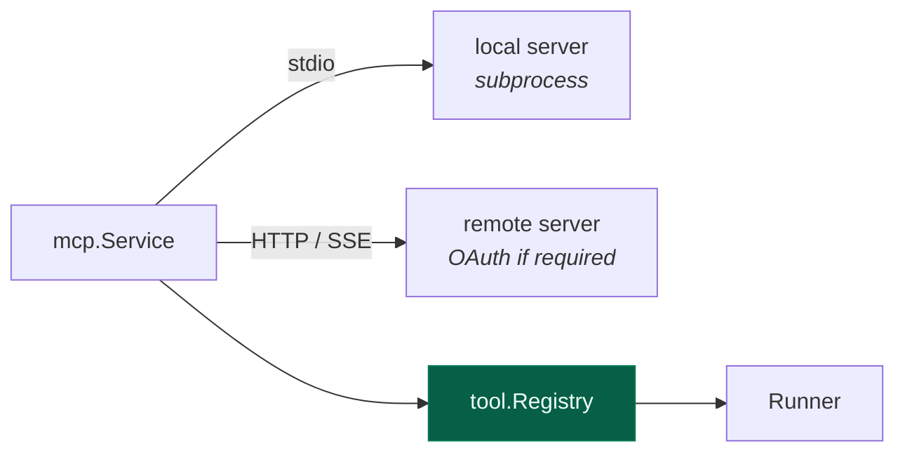

# 9. LSP & MCP

[← HTTP API](08-http-api.md) · [Index](README.md) · [Next: Development →](10-development.md)

---

Two protocol clients, two very different jobs. LSP makes the agent's edits
*correct*; MCP makes its capabilities *extensible*.

## LSP

The agent edits code. Without a language server it finds out an edit was wrong
when the build fails — several steps later. With one, it finds out immediately.



The model sees `internal/x.go:42:5: undefined: foo` in the same tool result as
"wrote the file". It fixes it on the next step rather than three steps later.

### Wire protocol

`jsonrpc.go` implements JSON-RPC 2.0 over `Content-Length`-framed stdio — the
same framing an editor uses. Servers are ordinary subprocesses.

`client.go` handles the `initialize` handshake, document sync, and
`publishDiagnostics` notifications.

### Two races, and their fixes

Both were real, both cost real debugging time, and both are still guarded by
tests.

**1. Waiting on a file that didn't change.** `Open` now reports whether it
actually sent anything:

```go
func (c *Client) Open(path string) (changed bool, err error)
```

If the document is unchanged, no notification goes out — so no diagnostics are
published — so a waiter blocks until timeout. The LSP test suite took 21
seconds because of exactly this: a 5-second stall per unchanged file. The
caller now skips the wait when nothing was sent.

**2. Diagnostics arriving before the waiter registered.** A fast server can
publish before `WaitForDiagnostics` is called, and the waiter then waits for an
event that already happened. Fixed with a sequence snapshot:

```go
seq := client.PublishSeq(path)      // snapshot BEFORE the edit
// ... make the change ...
client.WaitForDiagnostics(ctx, path, seq)   // "anything newer than seq"
```

Asking for "a publish newer than `seq`" is immune to ordering; asking for "the
next publish" is not.

### Server registry

`servers.go` declares 27 servers with the extensions they handle and how to
find them:

```
gopls · typescript · rust · pyright · ruff · clangd · zls · lua-ls · bash
terraform · dart · ocaml-lsp · gleam · nixd · clojure-lsp · elixir-ls
haskell-language-server · yaml-ls · json-ls · texlab · svelte · astro
prisma · dockerfile · csharp · kotlin-ls · sourcekit-lsp
```

Clients spawn **lazily**, on first touch of a matching file, and are keyed by
`root + serverID` — a monorepo with several Go modules gets one `gopls` per
root, not one shared instance with the wrong workspace.

> **Deliberate divergence from upstream.** The TypeScript version can `npm
> install` a missing language server at runtime. This port does not: it uses
> servers already on your `PATH`. Downloading and executing code at runtime is
> a different security posture, and a single static binary that silently grows
> an `npm` dependency isn't one.

Add your own in config:

```jsonc
"lsp": {
  "my-server": { "command": ["my-lsp", "--stdio"], "extensions": [".mylang"] }
}
```

Status shows in the TUI footer and at `GET /api/lsp`.

## MCP

[Model Context Protocol](https://modelcontextprotocol.io) servers add tools
from outside the binary — a GitHub client, a database browser, an internal
service.

`internal/mcp` uses the official
[`modelcontextprotocol/go-sdk`](https://github.com/modelcontextprotocol/go-sdk)
for the wire protocol and OAuth. Only the persistence, status machine and CLI
surface are hand-ported — matching how the TypeScript version uses the
official TS SDK.

### Transports



```jsonc
"mcp": {
  "github": {
    "type": "local",
    "command": ["gh-mcp"],
    "env": { "GITHUB_TOKEN": "{env:GH_TOKEN}" }
  },
  "internal": {
    "type": "remote",
    "url": "https://mcp.corp.example/sse"
  }
}
```

### Tool namespacing

`ToolName(clientName, name)` prefixes every tool with its server
(`naming.go`), so two servers can both expose `search` without colliding. Names
are sanitised to what providers accept as tool identifiers.

Once registered, an MCP tool is a `tool.Tool` like any other — same registry,
same permission gate, same `tool.called` events. The runner cannot tell the
difference, which is the point.

### Remote auth

Remote servers may require OAuth. The SDK provides authorization-code flow with
PKCE, discovery and dynamic client registration; this package adds a
**persisting token source** so a refreshed token is written back rather than
being refreshed again on every start.

### Connection lifecycle

Servers are connected at boot and **reconnected with backoff** on failure. A
dead MCP server degrades the tool set; it does not stop gocode from starting.
`GET /api/mcp` and `gocode mcp` report status.

## Skills

Adjacent to both: **skills** are markdown files describing a capability, loaded
on demand by the `skill` tool rather than sitting in the system prompt.

```
.gocode/skill/deploy.md
```

Discovered by `skill.Discover` and also exposed as slash commands — a skill
without a name collision becomes `/deploy`. Keeping them out of the system
prompt is what makes many skills affordable: they cost tokens only when used.

---

[← HTTP API](08-http-api.md) · [Index](README.md) · [Next: Development →](10-development.md)
