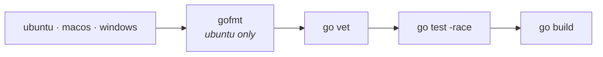
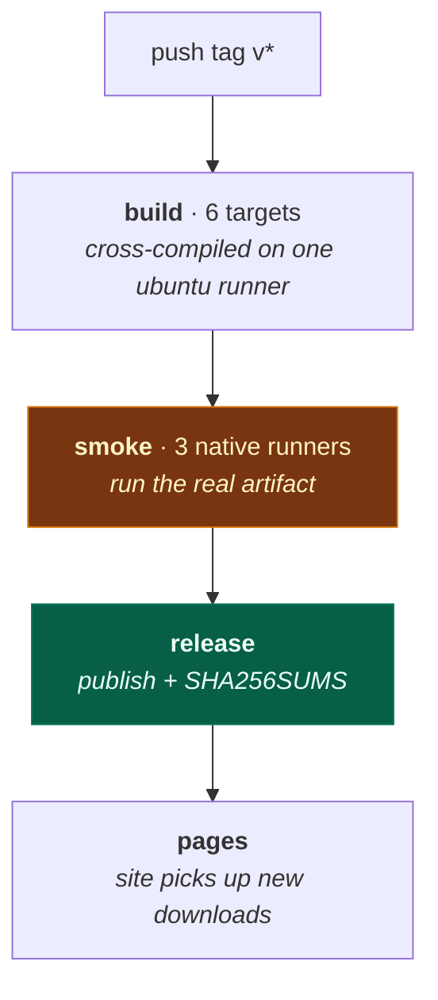

# 10. Development

[← LSP & MCP](09-integrations.md) · [Index](README.md)

---

## Setup

Go 1.27+ and nothing else. No code generation, no protobuf, no C toolchain.

```sh
git clone https://github.com/langazov/gocode
cd gocode
make build && ./gocode --version
```

## Make targets

| Target | Does |
|---|---|
| `build` | `./gocode`, version from `git describe` |
| `run` | build and run |
| `install` | into `$GOPATH/bin` |
| `test` | the full suite |
| `cover` | coverage profile + per-function report |
| `fmt` | `go fmt ./...` |
| `fmt-check` | fail if anything isn't gofmt-clean |
| `vet` | `go vet ./...` |
| **`check`** | **fmt-check + vet + test — exactly what CI runs** |
| `release` | optimised build into `dist/` |
| `wasm` / `wasm-run` | experimental WebAssembly build |
| `clean` | remove artifacts |

Run `make check` before pushing. It is the same trio CI runs, so a green local
run means a green CI run.

## Version stamping

Version and channel are injected into `internal/installation`:

```make
VERSION_PKG := github.com/langazov/gocode-go/internal/installation
LDFLAGS := -s -w -X $(VERSION_PKG).Version=$(VERSION)
```

> The Makefile comment records a bug worth not repeating: this used to be
> `-X main.version=...`, naming a symbol that does not exist. `-X` against a
> missing symbol **fails silently**, so every build — releases included —
> reported `local`. The release workflow now asserts the built binary does not
> report `local`, so this cannot regress unnoticed.

## Testing

862 test functions, ~22,000 lines. `go test ./...` runs in roughly a minute,
the TUI package accounting for most of it.

```sh
go test ./...                                   # everything
go test ./internal/session/...                  # one package
go test -run TestRunnerInterrupt ./internal/session/   # one test
go test -race ./...                             # what CI runs
```

### Conventions

- **Tests are named for the bug or behaviour**, not the function.
  `TestPasteNormalizesLineEndings` beats `TestPaste2`.
- **Regression tests cite the symptom.** From `paste_test.go`:
  ```go
  // TestPasteInsertsText is the regression for "paste into prompt is not
  // working": tea.PasteMsg fell through App.update's switch, so bracketed
  // paste was dropped and nothing appeared in the prompt.
  ```
  A year later that comment is what tells you whether the test still matters.
- **Fixtures are pinned.** `testCatalog(t)` pins a models.dev fixture via
  `GOCODE_MODELS_PATH` — a real bug hid here, where a test passed only
  because the catalog was empty, and a populated one let a developer's real
  `GITHUB_TOKEN` become a fallback candidate.

### Two hard-won lessons

**Verify a fix is load-bearing.** After a test passes, revert the fix and
confirm the test fails. A test that passes both ways proves nothing, and
several in this codebase were caught doing exactly that.

**Drive the real path.** The prompt-sizing tests passed exhaustively while the
bug was fully present, because they used `SetValue` to construct state —
skipping `input.Update()`, and therefore skipping the viewport scroll that
*was* the bug. If a test builds state directly instead of driving the input
path a user drives, it can be thorough and still worthless.

## Porting conventions

This is a port. Two rules follow.

**Cite the origin.** Non-obvious behaviour names its TypeScript source:

```go
// MaxStepsPrompt matches packages/core/src/session/runner/max-steps.ts.
// Runner drains eligible durable work for a session, porting the core loop
// of session/runner/llm.ts: ...
```

When behaviour looks wrong, check the cited file before "fixing" it. It is
usually faithful.

**Document divergences as divergences.** Where the Go port differs
deliberately, say so and say why:

```go
// MCP prompts are a source upstream and are not one here: this port's MCP
// client does not implement prompts/list.
```

Known deliberate divergences:

| Divergence | Why |
|---|---|
| No runtime `npm install` for language servers | executing downloaded code at runtime is a different security posture |
| `.well-known` provider config asks for confirmation | it is remote configuration |
| Unmatched `/command` falls through to a report | silently swallowing input is worse than saying "unknown" |
| MCP prompts not exposed as commands | `prompts/list` not implemented |
| External plugins are subprocesses, not imported modules | a linked Go binary cannot load unknown code in-process; see [Plugins](09-integrations.md#plugins) |
| No runtime install for plugins either | same posture as language servers: a configured plugin is compiled in or already on disk |
| A failing plugin hook is reported and skipped, not fatal | upstream's `Effect.promise` makes a rejected hook a defect that aborts the turn — one broken third-party plugin should not take down the agent |
| Plugin auth/provider registrations are built-in only | an OAuth flow is a conversation, not a request/response, and modelling it over stdio would add a callback channel with no user yet |

## CI

`.github/workflows/ci.yml` — on push and PR:



gofmt runs on Ubuntu only — formatting is platform-independent, and running it
three times just triples the failure noise.

## Releasing

```sh
git tag v0.1.0
git push origin v0.1.0
```



Six targets: macOS/Linux/Windows × arm64/x64. Each ships **twice** — a bare
executable and an archive of the same build.

The **smoke job** is the important one. Cross-compiled binaries that don't
start are worse than no release, so each artifact is downloaded onto its native
runner, checksum-verified, and actually run — both the bare binary and the copy
from the archive. It fails the release if either reports `local`.

`workflow_dispatch` builds everything without tagging, for a dry run.

### Action pinning

Every action is pinned to a **commit SHA**, not a tag:

```yaml
uses: actions/checkout@34e114876b0b11c390a56381ad16ebd13914f8d5 # v4.3.1
```

Tags are mutable. A compromised action tag would run arbitrary code with the
release token; a SHA cannot be moved.

## The website

`docs/` holds the GitHub Pages site — one self-contained `index.html`, no build
step, no external resources beyond the GitHub API call that lists downloads.
`pages.yml` deploys it on push to `main`, after a release, or manually.

The engineering docs you are reading live in `documentation/` precisely so they
don't collide with the published site.

## Adding things

| To add | Start at |
|---|---|
| A tool | `internal/tool/builtins/` — copy `glob.go`, register in `builtins.go` |
| A provider | config first; a transform only if it needs structure ([Providers](04-providers.md)) |
| An LSP server | `internal/lsp/servers.go`, or config |
| An API route | `internal/server/server.go` `Mux()` |
| A slash command | `.gocode/command/*.md` — no Go needed |
| A durable event | define it, register a projector, **then** publish it |

That last one has an order that matters: an event published with no registered
projector commits successfully and updates nothing. The divergence check won't
catch it, because it only detects projections that *disagree* — not ones that
never ran.

---

[← LSP & MCP](09-integrations.md) · [Index](README.md)
