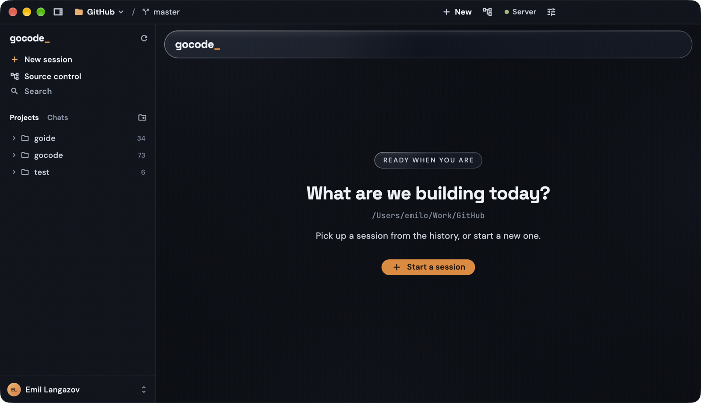
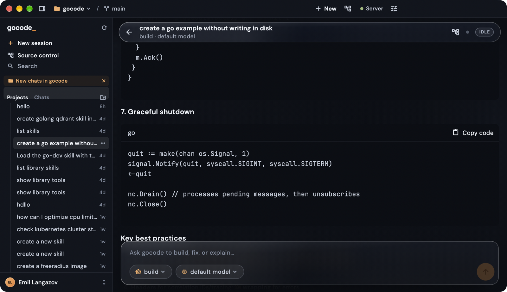
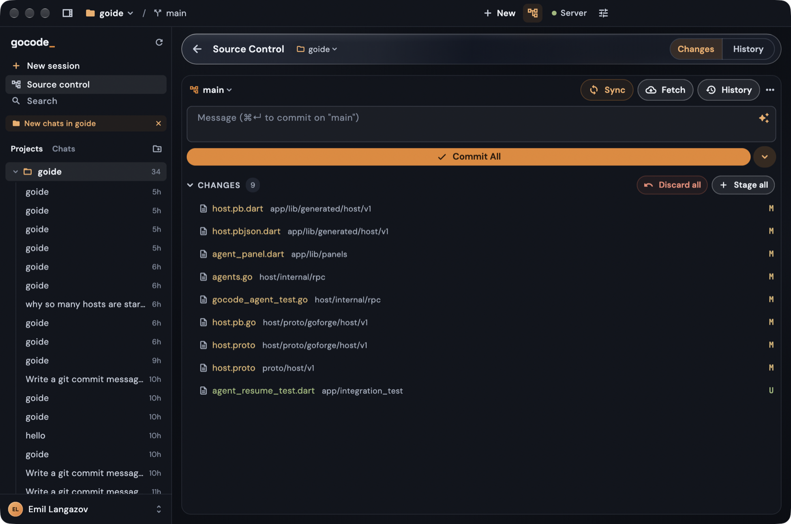
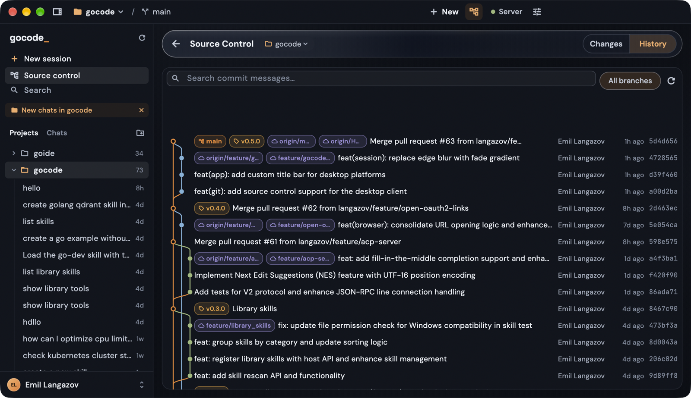

# 11. Gocode Desktop

[← Development](10-development.md) · [Index](README.md)

---

`gocode_gui/` is **Gocode Desktop**, a Flutter client for the same agent the
TUI drives. It runs on macOS, Linux and Windows. Like the TUI, it holds no
agent logic of its own: it starts a `gocode` process (or attaches to one that
is already running) and talks to it over the HTTP API or the Agent Client
Protocol.

<p align="center">

</p>

## Install

### Homebrew (macOS)

The shortest path on a Mac. The cask lives in
[langazov/homebrew-tap](https://github.com/langazov/homebrew-tap) next to the
`gocode` formula, and installs a universal build that runs on both Apple
silicon and Intel, macOS 12 (Monterey) or later.

```sh
brew install --cask langazov/tap/gocode-desktop
```

That one command taps the repository and installs the app into
`/Applications/Gocode Desktop.app`. The app is only a client, so the cask
depends on the `gocode` formula. If you don't already have the CLI, Homebrew
installs it first, along with the extras the formula brings (`mdlsp`,
`rag-plugin`, `library-plugin`; see the
[README](../README.md#homebrew-macos-and-linux)). The app finds that binary
through your login shell's `PATH`, which includes Homebrew's prefix, so there
is nothing to configure.

The app is not signed or notarized yet, and Homebrew quarantines what a cask
downloads, so the cask clears the quarantine flag after installing. Gatekeeper
opens the app without the manual `xattr` step a hand-downloaded copy needs.

New versions arrive with the CLI's: every release updates both the formula and
the cask in the tap.

```sh
brew upgrade --cask gocode-desktop   # just the app
brew upgrade                         # the app, gocode, and everything else
```

To remove it:

```sh
brew uninstall --cask gocode-desktop          # the app; gocode stays installed
brew uninstall --zap --cask gocode-desktop    # ...and its preferences and caches
```

`--zap` also deletes the app's saved state under `~/Library` (Application
Support, Caches, Preferences and Saved Application State for
`dev.gocode.gocodeGui`). Your sessions and config are not touched: they belong
to `gocode` and live under `~/.local/share/gocode` and `~/.config/gocode`.

The cask is macOS-only, since a cask installs a `.app` bundle. On Linux,
Homebrew installs only the `gocode` CLI. Use the archive below for the app.

### Download

The desktop app ships in every [release](https://github.com/langazov/gocode/releases/latest)
next to the CLI, as `gocode-desktop-*` archives.

| Platform | Archive | Run |
|---|---|---|
| macOS (Apple silicon + Intel) | `gocode-desktop-<version>-macos-universal.zip` | move `Gocode Desktop.app` to Applications |
| Linux x86_64 | `gocode-desktop-<version>-linux-x64.tar.gz` | `gocode-desktop/gocode-desktop` (needs GTK 3) |
| Windows x64 | `gocode-desktop-<version>-windows-x64.zip` | `gocode-desktop\gocode-desktop.exe` |

Installed by hand, the app is unsigned, so on macOS clear the quarantine flag
once:

```sh
xattr -dr com.apple.quarantine "/Applications/Gocode Desktop.app"
```

**The app needs the `gocode` binary.** It looks on the login shell's `PATH`,
then its own `PATH`, then `/opt/homebrew/bin`, `/usr/local/bin`, `~/go/bin`
and `~/.local/bin` (`%USERPROFILE%\go\bin` on Windows), and finally asks
`which`/`where`. If none of those finds it, set the path in **Settings →
Connection**.

## Connecting

On first launch the app asks for a project folder. It then starts a local
agent in that folder, or, under **Connect to a server**, attaches to one
elsewhere. The connection mode is set in **Settings → Connection**:

| Mode | What it does |
|---|---|
| **Server** (default) | Spawns `gocode serve` on an ephemeral loopback port and uses the HTTP API + SSE event stream. Full surface: sessions, account, providers, source control, LSP/MCP status. |
| **ACP** | Spawns `gocode acp` and speaks the [Agent Client Protocol](https://agentclientprotocol.com) v1 over stdio, the same surface editors such as Zed drive. Sessions, prompts, config options and permission asks only. |
| **Remote** | Attaches to an already-running `gocode serve` over the network, like `gocode attach`. |

In Server mode the app supervises the child process: it waits for the
`gocode server listening on …` line, health-checks the URL, and shuts the
server down gracefully (SIGTERM, then kill) when the app quits. Apps launched
from the Finder or Dock inherit launchd's minimal `PATH`, so the app hands the
server the login shell's `PATH` instead. Without it, language servers and MCP
servers configured by bare command name would not start.

ACP is narrower by design. The protocol has no account, provider or git
routes, so those screens show their signed-out or empty state in ACP mode.
Switch to Server mode to use them.

## Sessions

The sidebar groups sessions by project folder (**Projects**), or lists them
flat by recency (**Chats**). **Search** filters both by session title, project name or folder. The title bar
holds the project switcher, the current branch, **New** for a new session, and
the connection status.

<p align="center">

</p>

A session is a timeline of the agent's turns, rendered as markdown: headings,
lists, tables, inline code, and fenced code blocks with syntax highlighting
and a **Copy code** button. Each turn ends with its token count and cost. The
prompt box at the bottom has pickers for the agent (`build`, `plan`, …) and the
model. `↑` at the start of the prompt (or `↓` at its end) walks the prompt
history.

<p align="center">

</p>

When the agent asks for permission (a bash command, an edit outside the
project, …) the ask appears inline with **Allow once**, **Always allow** and
**Deny**. When it asks you a question, you get **Answer** and **Dismiss**.
These are the same permission rules the TUI enforces. See
[Tools & permissions](05-tools-and-permissions.md).

Closing the window hides it instead of quitting, so a running agent and its
server keep going. A menu-bar / system-tray icon brings the window back.
**Quit** is in the tray icon's right-click menu.

## Source Control

**Source control** in the sidebar (or the branch icon in the title bar) opens
a git view of the selected project. It works in Server and Remote modes,
backed by the `/api/vcs/git/*` routes described in
[HTTP API → Source Control](08-http-api.md#source-control-apivcsgit).

<p align="center">

</p>

**Changes** lists the working tree. You can stage, unstage or discard files
(or single hunks from the diff viewer), then commit with `⌘↵` / `Ctrl+↵`. The
✦ button in the message box asks the server's model to draft a commit message
from the staged changes, or from all changes if nothing is staged. The branch
picker switches, creates, renames, merges and deletes branches. **Sync**,
**Fetch** and the `⋯` menu run pull, push, fetch and stash operations.

<p align="center">

</p>

**History** draws the commit graph across all branches (or just the current
one), with branch, remote and tag labels on each commit. You can search commit
messages, and opening a commit shows its message, changed files and per-file
diffs.

## Account

The avatar menu at the bottom of the sidebar signs in to
[gocoder.org](https://gocoder.org) and, once signed in, opens **Profile**,
**User settings**, **Usage** (tokens per day over 7, 30 or 90 days) and
**Invite a friend**, next to the app's own **Settings**. The account screens
need Server or Remote mode.

## Building from source

Requires Flutter (CI pins the version in `.github/workflows/gui-ci.yml`).

```sh
cd gocode_gui
flutter pub get
flutter run -d macos            # or: -d linux, -d windows
flutter build macos --release   # -> build/macos/Build/Products/Release/
```

Tests:

```sh
flutter test            # unit + widget tests (a fake ACP agent covers the protocol layer)
flutter analyze

# End-to-end against a real gocode binary (opt-in):
GOCODE_GUI_ACP_E2E=1 GOCODE_BIN=/path/to/gocode \
  flutter test test/acp_e2e_test.dart
```

`gui-ci.yml` formats, analyzes, tests and builds the app whenever
`gocode_gui/**` changes. `release.yml` builds it natively on each OS, because
Flutter cannot cross-compile desktop apps, and publishes it in the same
release as the CLI.

### Layout

```
gocode_gui/lib/
  app/                  shell, theme, custom title bar, tray, connect screen
  core/acp/             ACP v1 client: JSON-RPC over stdio, protocol types,
                        update→timeline projection, per-session controller
  core/api/             HTTP client + SSE (Server/Remote modes)
  core/connection/      connection settings and lifecycle shared by all modes
  core/process/         supervisor for the local `gocode serve` child
  features/session/     session timeline and prompt
  features/sidebar/     projects, chats, history grouping
  features/asks/        permission asks and questions
  features/git/         Source Control: changes, diff viewer, branches,
                        history graph
  features/account/     gocoder.org sign-in, profile, usage
  features/settings/    connection settings
```

---

[← Development](10-development.md) · [Index](README.md)
