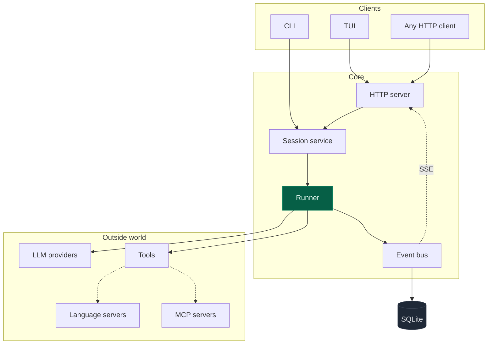

# gocode documentation

Detailed documentation for the Go port of opencode — how it is put together,
why it is put together that way, and where to look when changing it.

> **Why not `docs/`?** That directory is the published GitHub Pages website.
> These are the engineering docs, rendered by GitHub directly in the repo
> (diagrams included — the Mermaid blocks below render natively).

## Start here

| | | |
|---|---|---|
| **1** | [Architecture](01-architecture.md) | Process model, boot sequence, package layering, the client/server split |
| **2** | [Data model](02-data-model.md) | SQLite schema, event sourcing, projections, replay and divergence |
| **3** | [The session runner](03-session-runner.md) | The agent loop, durability, concurrency, interrupts, compaction |
| **4** | [Providers & models](04-providers.md) | The models.dev catalog, transforms, authentication, OAuth |
| **5** | [Tools & permissions](05-tools-and-permissions.md) | The 13 builtins, the tool contract, the allow/deny/ask engine |
| **6** | [The TUI](06-tui.md) | Bubble Tea architecture, the prompt, dialogs, streaming |
| **7** | [Configuration](07-configuration.md) | Every config key, precedence, agents, skills, commands |
| **8** | [HTTP API](08-http-api.md) | Route reference and the SSE event stream |
| **9** | [LSP, MCP & plugins](09-integrations.md) | Language servers, Model Context Protocol clients, and the plugin host |
| **10** | [Development](10-development.md) | Building, testing, releasing, and the porting conventions |

## The 60-second version

`gocode` is an AI coding agent that runs in your terminal. You type a request;
it reads and edits files, runs commands, and reports back — asking permission
before anything destructive.

Three facts explain most of the design:

**1. The TUI is an HTTP client, always.** Even when you run `gocode` with no
arguments, it boots a full server on an ephemeral loopback port and connects
over HTTP. There is no "local mode" that bypasses the API, so `attach` to a
remote machine exercises the exact same code path.

**2. State is event-sourced.** Nothing the agent does becomes visible state
directly. It emits a durable event, which is committed to SQLite atomically
with its projections. This is what makes a killed process resumable and what
lets several clients watch one session.

**3. Everything is one binary.** `CGO_ENABLED=0` throughout, with a pure-Go
SQLite. All six release targets cross-compile from a single Linux runner.

## Conventions used throughout

This is a **port**, not a rewrite from a spec. Two conventions follow from
that and appear everywhere in the source:

- **Every non-obvious behaviour cites its TypeScript origin.** When you see
  `// ports packages/core/src/session/runner/llm.ts`, that file is the
  authority on what the code should do. Behaviour that looks wrong is usually
  faithful.
- **Deliberate divergences are documented as such.** Where the Go port does
  something different — no runtime `npm install`, for instance — the comment
  says so and says why. Silence means "same as upstream".

## Numbers

| | |
|---|---|
| Source | ~36,300 lines across 33 internal packages |
| Tests | ~22,000 lines, 862 test functions |
| Direct dependencies | 13 |
| Binary | ~25 MB, statically linked |
| Release targets | 6 (macOS/Linux/Windows × arm64/x64) |
| Built-in tools | 13 |
| Language servers | 27 |
