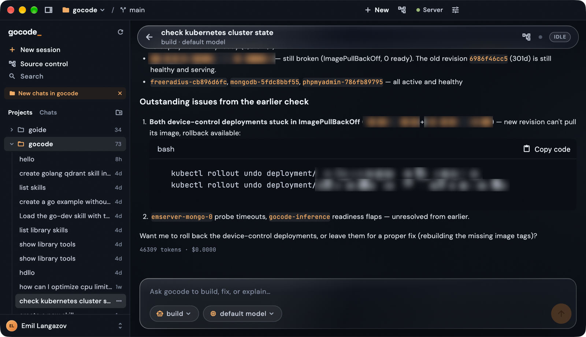

# Gocode Desktop

Gocode Desktop — a Flutter client for the gocode coding agent.



Install, usage and screenshots: [documentation/11-desktop.md](../documentation/11-desktop.md).

## Transports

The app talks to gocode over two transports, chosen at connect time:

| Mode | What it does |
|---|---|
| **Server** (default) | Spawns `gocode serve` and uses the HTTP API + SSE event stream. Full surface: account, providers, VCS, LSP/MCP status. |
| **ACP** | Spawns `gocode acp` and speaks the [Agent Client Protocol](https://agentclientprotocol.com) v1 over stdio — the same agent surface editors (Zed, JetBrains, …) drive. Sessions replay over the protocol; permission asks arrive as agent→client requests answered in-app. |
| **Remote** | Attaches to an already-running server's HTTP API over the network. |

ACP is the narrower surface by design — the protocol covers sessions,
prompts, config options and permission asks, but not account/provider
management. Those screens fall back to their signed-out state in ACP mode;
switch to Server mode to manage providers and the gocoder.org account.

## Testing

```sh
flutter test            # unit + widget tests (a fake ACP agent covers the protocol layer)
flutter analyze

# End-to-end against a real gocode binary (opt-in):
GOCODE_GUI_ACP_E2E=1 GOCODE_BIN=/path/to/gocode \
  flutter test test/acp_e2e_test.dart
```

## Layout

```
lib/core/acp/        ACP v1 client: JSON-RPC over stdio, protocol types,
                     update→timeline projection, per-session controller
lib/core/api/         HTTP client + SSE (Server/Remote modes)
lib/core/connection/  Connection settings/lifecycle shared by all modes
lib/features/…        Screens (session timeline, sidebar, asks, settings)
lib/features/git/     Source Control (changes, diff viewer, branches,
                     history graph) over /api/vcs/git — Server/Remote
                     modes only; ported from goide
```
